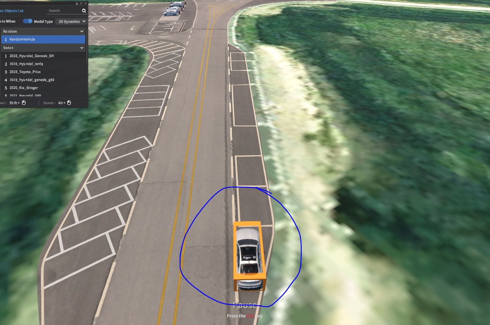
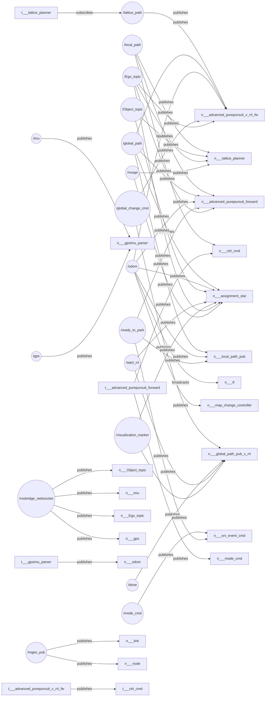

## 전진 주차

#### 장애물 시나리오


<br>

#### 하차지점 (ego차량 주행 시작 지점)



<br>

#### launch 파일

```
roslaunch rrt_forward_3 parking_lot_v_rrt_forward.launch
```


#### 사용 경로

1. 하차지점 ---- 로타리 끝점 : dikjstra 경로
2. 로타리 끝점 ---- 주차장 진입 : parkinglot_entrance_tiny.txt
3. 주차장 내부 뺑뺑이 경로 : parkinglot_driving_test_tiny.txt
4. RRT로 찾은 경로 저장되는 파일 : ssafy_test_path_star.txt

<br>

#### Node Graph



