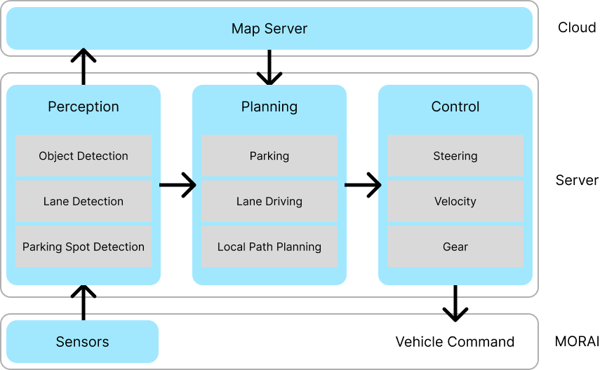
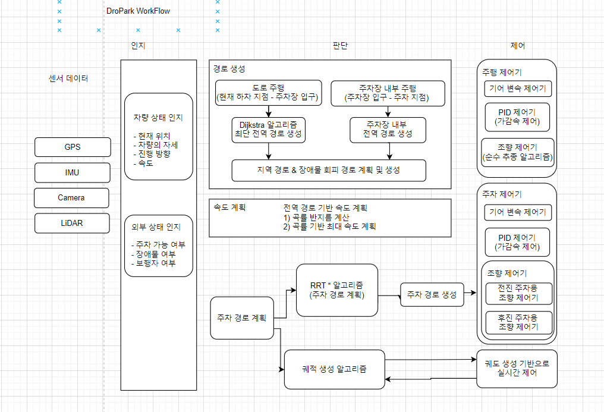

# AVP (Automated Valet Parking)
목차
1. [문서 수정 이력](#문서-수정-이력)
2. [개요](#개요)
3. [기획](#기획)
4. [정의](#정의)
5. [개발](#개발)
6. [참고 문헌](#참고-문헌)

## 문서 수정 이력
|Ver.|Desc.|Author|Date|Notes|
|:---:|:---|:---:|:---:|:---|
|0.1|README.md 생성|정현우|2024-02-27||
|0.1.1|형식 정의|정현우|2024-02-28||
|0.1.2|초안 작성|정현우|2024-02-28||
|0.1.2|명세서 및 구조도 추가|정현우|2024-03-07||
|0.1.3|개발 환경 추가|정현우|2024-03-22||
|0.2.0|개발 진행 사항 추가|정현우|2024-03-22|중간 평가|

## 개요
삼성 청년 SW 아카데미 심화 과정 中 특화 프로젝트임.
### 프로젝트 정보
---
|제목|내용|
|:---:|:---|
|프로젝트 명|AVP (Automated Valet Parking)|
|프로젝트 기간|2024.02.19. ~ 2024.04.05.|
|주최|삼성 청년 SW 아카데미|
|개발환경|[하단](#개발환경) 참고|
|기술스택|ROS, Python|
|팀 구성| 정현우(팀장), 김태환, 박건률, 임수헌, 정원영, 조한준|
|결과|TBU|

### 개발환경
#### PC 사양
|분류|사양|
|:---:|:---|
|CPU|11th Gen Intel(R) Core(TM) i7-11600H @ 2.90GHz   2.92 GHz|
|RAM|32.0GB|
|GPU|NVIDIA GeForce RTX 3050 Ti Laptop GPU|
|OS|Windows 10 Enterprise|

#### WSL 환경
|분류|Ubuntu 18.04|Ubuntu 20.04|
|:---:|:---|:---|
|Python|2.7.17|3.8.10|
|ROS|melodic|noetic|


## 기획
### 기획 배경
---
#### 1) 차량 이용의 시간 비효율성  
차량을 이용하는데 다음과 같은 과정들이 진행됨에 따라 이용자는 시간을 추가로 소비해야 함.
- 차량을 이용해서 목적지로 이동할 때
    1. 운전자가 주차장에 주차되어 있는 차량 위치까지 이동함.
    2. 운전자가 차량에 탑승함.
    3. 탑승 후 직접 운전을 통해 주차장을 빠져나옴.
- 차량을 이용해서 목적지에 도착했을 때
    1. 주차장에서 차량을 주행하며 주차 가능 공간을 찾아야 함.
    2. 주변을 살피며 주차 공간에 맞춰 차량을 주차함.
    3. 운전자가 차량에서 하차함.
    4. 주차 위치에서 주차장 출구까지 이동함.
#### 2) 주차의 어려움
주차 과정에 다음과 같은 문제점들을 발생할 수 있음.
1. 주차장의 많은 차량으로 인해 주차 공간 확보에 어려움이 있을 수 있음.
2. 주변 주차 차량으로 인해 주차/출차 과정에서 충돌이 발생할 수 있음.
3. 주차된 차량 간의 간격이 좁아 승/하차 과정에서 추가 충돌이나 어려움이 발생할 수 있음.

### 기획 의도
---
1. 시간 효율성 증가: 이용자가 차량을 이용하기까지의 시간 단축.
2. 주차 위험성 감소: 운전자가 주/출차 과정에서 발생할 수 있는 타 차량과의 충돌 등과 같은 위험섬을 감소.

### 사전 조사
---
#### 관련 기술 활용 현황
- [KIA 원격 스마트 주차 보조 시스템 (RSPA2)](https://connectstore.kia.com/kr/product/rspa2)
    - 선, 후진, 직각 주차
    - 차량에 탑재된 광각 카메라와 초음파센서가 주차 공간과 주차선을 탐색
    - 스마트 출차 기능 (평행 주차 상황)
    - 주차 공간이 좁아 승하차의 불편함을 겪을 때, 차량 내부와 외부에서 모두 손쉽게 원격 제어로 전/후진이 가능

## 정의
### 레포지토리 정의
---
```
├─control       : 제어 알고리즘 (control branch)
├─planning      : 판단 알고리즘 (planning branch)
├─perception    : 인지 알고리즘 (perception branch)
└─TIL           : 학습 기록 (Today I Learned)
```

### 기능 명세서
---
- [노션 참고](https://flannel-pound-58d.notion.site/e4e8c25c7458417fb54f1fba40442bf9?pvs=74)

### 구조 정의서
---




### 기능 정의서
---
- 자율 주행  
    주차장 내에서 운전자 없이 운전하는 기능
- 주차 공간 탐지  
    주차장을 주행하며 주차 가능 공간 탐지
- 자율 주차  
    탐지된 주차 가능 공간에 자율 주차
- 자율 출차  
    호출 신호 감지 시 출차 이후 자율 주행을 통해 주차장 입구까지 이동

### Convention
---
- Git Convention: [노션 참고](https://flannel-pound-58d.notion.site/Git-Convention-c23cab82046b427298e3944b4551ca4d)
- Code Convention: [노션 참고](https://flannel-pound-58d.notion.site/Code-Convention-12ce038d90fc40498bc4582441d2e98e?pvs=74)

## 개발
### 진행 상황
#### 인지 알고리즘
- AI 기술 적용 실패 ( [인지 알고리즘 문서](./TIL/정현우/인지%20알고리즘.md) 참고)
- 명세서 기반 인지 알고리즘 구현 시도 중
#### 자율 주행
- 명세서 2 기반 자율 주행 개발 완료
- 물체 회피 기능 개발 완료 (w/ sigmoid)
#### 자율 주차
- 직각 주행 알고리즘 구현 완료
- 가변 원호 이용 알고리즘 구현 진행 중
- RRT* 구현 중

## 사용법
### 환경 세팅
- [환경 세팅](./exec/setting/setting.md)

### 실행
- [실행](./exec/run/run.md)

### 시나리오
- [시나리오](./exec/scenario/scenario.md)

### 아키텍쳐
- [주행 및 주차 아키텍쳐](./exec/system_architecture/주행%20및%20주차%20아키텍쳐.md)

## 참고 문헌
- [PythonRobotics](https://github.com/AtsushiSakai/PythonRobotics)