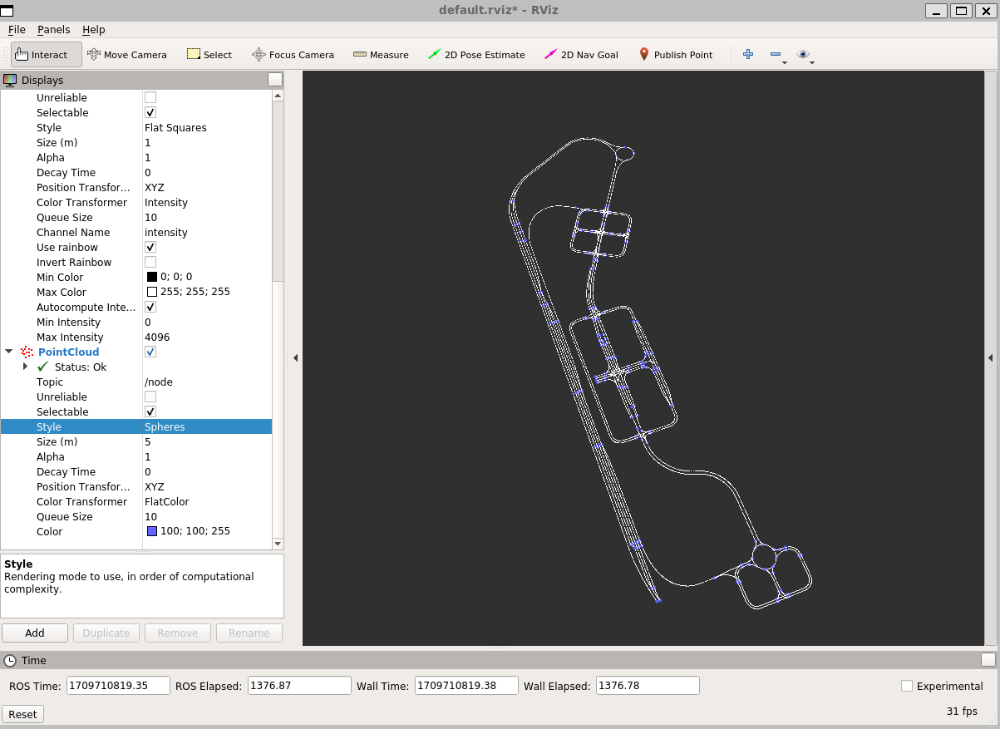

# 2. 정밀도로 지도

---

| req 2-1 | [MGeo 시각화](#req-2-1-mgeo-시각화) | Json 형식 MGeo 데이터 확인
Node, Link 데이터 → ROS Point Cloud 형식으로 변환
Rviz로 Node, Link 확인 |
| --- | --- | --- |

### Req 2-1. MGeo 시각화

---

- mgeo.py
    - ‘R_KR_PG_K-city’ 맵에 대한 정밀도로지도 파일을 읽어서 node와 link의 개수를 확인하는 파일

- mgeo_pub.py
    - 위와 같이 node와 link 정보를 읽어옴
    - node와 link 정보를 PointCloud 메시지 형태로 변환하여 node_msg / link_msg 에 저장
        - PointCloud 형식
            
            ```python
            # This message holds a collection of 3d points, plus optional additional
            # information about each point.
            
            # Time of sensor data acquisition, coordinate frame ID.
            Header header
            
            # Array of 3d points. Each Point32 should be interpreted as a 3d point
            # in the frame given in the header.
            geometry_msgs/Point32[] points
            
            # Each channel should have the same number of elements as points array,
            # and the data in each channel should correspond 1:1 with each point.
            # Channel names in common practice are listed in ChannelFloat32.msg.
            ChannelFloat32[] channels
            ```
            
            - geomety_msgs/Point32
                
                ```python
                float32 x
                float32 y
                float32 z
                ```
                
            - ChannelFloat32
                
                ```python
                # This message is used by the PointCloud message to hold optional data
                # associated with each point in the cloud. The length of the values
                # array should be the same as the length of the points array in the
                # PointCloud, and each value should be associated with the corresponding
                # point.
                
                # Channel names in existing practice include:
                #   "u", "v" - row and column (respectively) in the left stereo image.
                #              This is opposite to usual conventions but remains for
                #              historical reasons. The newer PointCloud2 message has no
                #              such problem.
                #   "rgb" - For point clouds produced by color stereo cameras. uint8
                #           (R,G,B) values packed into the least significant 24 bits,
                #           in order.
                #   "intensity" - laser or pixel intensity.
                #   "distance"
                
                # The channel name should give semantics of the channel (e.g.
                # "intensity" instead of "value").
                string name
                
                # The values array should be 1-1 with the elements of the associated
                # PointCloud.
                float32[] values
                
                ```
                
        
        - links
            - Map에 있는 Line의 집합 (link_set)
                - 각 Line들은 다시 idx, from-to node, Points, max speed 등의 정보를 가지고 있음
                - Points : Line의 경로 상에 있는 좌표들, 주행 도로의 중간에 위치한 Point들
                - PointCloud 메시지 형식에 Point 값을 파싱하여 all_link에 저장
                
                ```python
                # link Point 추출
                
                def getAllLinks(self):
                    all_link=PointCloud()
                    all_link.header.frame_id='map'
                
                    for link_idx in self.links.values() :
                        for point in link_idx.points:
                            pt = Point32()
                            pt.x = point[0]
                            pt.y = point[1]
                            pt.z = point[2]
                            all_link.points.append(pt)
                
                    return all_link
                ```
                
            
        - Node
            - Map에 있는 Node의 집합 (node_set)
                - 각 Node들에 대한 Point를 all_node에 저장
                
                ```python
                def getAllNode(self):
                    all_node=PointCloud()
                    all_node.header.frame_id='map'
                
                    for nodes in self.nodes.values() :
                        pt = Point32()
                        pt.x = nodes.point[0]
                        pt.y = nodes.point[1]
                        pt.z = nodes.point[2]
                        all_node.points.append(pt)
                
                    return all_node
                ```
                
    
    - 저장한 all_node, all_link 정보를 Publish
    - rqt, rviz를 통해 시각화 정보 확인
    - rviz 시각화 순서
        
        ```python
        # 터미널1
        $ roscore
        ```
        
        ```python
        # 터미널2
        $ rosrun [패키지] mgeo_pub.py
        ```
        
        ```python
        # 터미널3
        $ rviz
        
        # 만약 rviz 실행 시 segmentation fault 에러 뜬다면
        $ echo "export DISPLAY=:0" >> ~/.bashrc
        $ source ~/.bashrc
        $ echo 'export LIBGL_ALWAYS_INDIRECT=0' >> ~/.bashrc
        $ source ~/.bashrc
        ```
        
        ```python
        # 터미널4
        rqt
        ```
        
        - rqt에서 /node, /link 체크 (Subscribe)
        - rviz 하단 Add → By topic → 생성된 /node, /link의 PointCloud 클릭 후 OK
        - rviz 좌측 환경 세팅에서 Point의 크기, 색상등 조절하여 시각화
    

