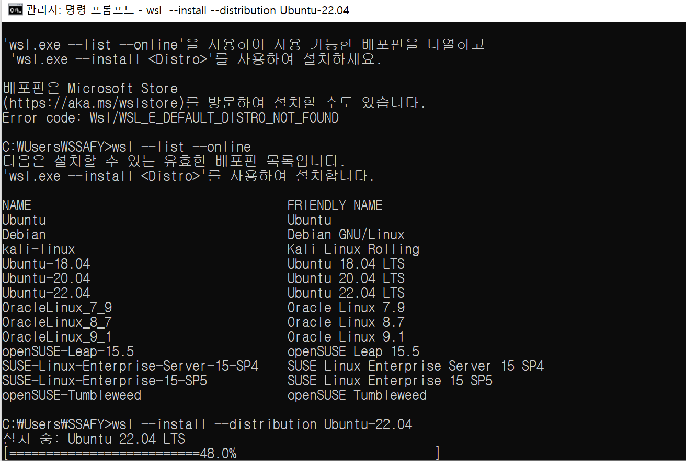

# WSL + Ubuntu 설치

---

### WSL 설치

---

```bash
wsl --install
```

### Ubuntu 설치

---

```bash
wsl --install --distribution Ubuntu-18.04
```



- 설치 완료 후 username + password 입력

- ubuntu 설치 확인 (CMD)
    
    ```bash
    wsl -l -v
    ```
    
    