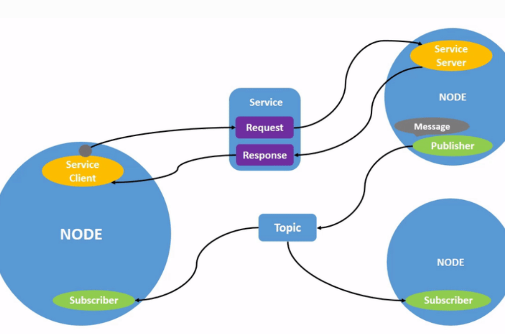

# ROS2 패키지 생성 및 실행

---

### Node

---

- Node는 ROS2의 실행 단위, 각 Node는 독립적으로 실행되며, 다른 Node와 메시지 교환 가능
- 각 Node는 단일, 모듈 목적을 가짐



### ros2 실행

---

- ros2 실행
    
    ```bash
    ros2 run [package_name] [executable_name]
    ```
    
    - executable_name : 해당 패키지에 탑재되어 있는 실행 파일
        
        → 파일 확인 방법
        
        ```bash
        cd /opt/ros/humble/lib/[패키지명]
        ```
        
        - 위 경로로 들어가면 실행파일들을 볼 수 있다.

- 실행중인 node 확인
    
    ```bash
    ros2 node list
    ```
    
- Remapping
    
    ```bash
    ros2 run turtlesim turtlesim_node --ros-args --remap __node:=my_turtle
    ```
    
    - node를 실행할 때 node의 이름을 사용자가 지정할 수 있음
    
- node 정보 확인
    
    ```bash
    ros2 node info [node명]
    ```
    
    - 해당 Node의 Sub, Pub, Service 정보를 확인 할 수 있음
    - Node들은 설정된 Topic에 대해 발행 또는 구독을 등록하고 Topic을 기반으로 통신 함
    
- rqt_graph
    
    ```bash
    rqt_graph
    ```
    
    - Node간 통신이 이루어지는 구조를 시각화하여 보여주는 툴

- topic List
    
    ```bash
    ros2 topic list
    ```
    
    - 현재 실행중인 Node들이 사용중인 topic들의 list를 확인할 수 있음
    - -t 옵션을 주면 매핑된 msg 정보를 알려줌 (실제 msg 주는 파일 경로)