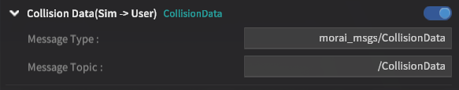

# 명세서 기반 학습 - ROS/Python

---

### Publish & Subscribe

---

- talker.py
    
    ```python
    publisher = rospy.Publisher('ssafy', String, queue_size=10)
    # Publisher('발행할 Topic', 메시지 형식, 사용할 메모리 size)
    rospy.init_node('ros_talker', anonymous=True) 
    # init_node('Node 이름', anonymous=True) 
    ```
    
    - rospy의 Publisher 메서드 사용
    - 발행할 Topic과 메시지 형식을 지정하여 마스터에 메시지 전송
    
- listener.py
    
    ```python
    rospy.init_node('ros_listener', anonymous=True)
    rospy.Subscriber('ssafy', String, callback)
    ```
    
    - rospy의 Subscriber 메서드 사용
    - 구독할 Topic과 메시지 형식을 지정 → 마스터에서 구독한 Topic의 메시지가 발행되었을 때 callback 함수 동작
    

### Data Subscribe

---

- get_collision_status.py
    
    
    
    - 시뮬레이터에서 전송하는 충돌 신호 데이터를 받아옴
    - data는 지속적으로 받고 있으며, 충돌이 발생할 경우 data에 충돌한 Object, position 등의 정보를 받아올 수 있음

- get_obj_status.py
    
    
    
    - 맵에 설치된 Object 정보를 수집함
    
- get_ego_status.py
    
    
    
    - Ego 차량에 대한 정보를 수집
    
- get_traffic_status.py
    
    
    
    - 맵 상에 존재하는 신호등 상태에 대한 정보를 제공받음
        
        Ex. 빨간불 = 2 / 초록불 = 16 / 직좌 신호 = 48
        

### Controller Publish

---

- set_ctrl_cmd.py
    
    
    
    - 사용자가 입력한 속도, 조향, 가속 값 등의 정보를 발행하여, 시뮬레이터에서 Automode로 진입하였을 때 수행될 동작을 입력함
    

### Sensor 메시지

---

- get_camera.py
    
    
    
    - 각 센서들은 각 하나의 Node이며 Bridge에 접속함
    - Topic과 메시지 형식을 지정할 수 있음
    - get_camera.py 파일에서 받은 데이터를 cv2 imshow 메서드를 통해 카메라 영상을 실시간으로 확인함
    
    
    
    - 3개의 카메라에 서로 다른 Ground Truth를 주어 영상 확인