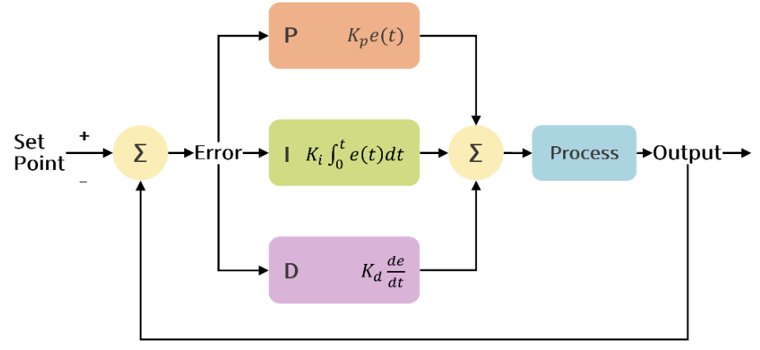

# 명세서 기반 학습 - 경로 계획 및 판단/제어2

---

- 참조 사이트
    - [https://velog.io/@717lumos/Control-PID-제어](https://velog.io/@717lumos/Control-PID-%EC%A0%9C%EC%96%B4)
    - [https://m.blog.naver.com/jsrhim516/222015965919](https://m.blog.naver.com/jsrhim516/222015965919)

### PID

---

- 원하는 값에 도달하기 위한 자동 피드백 제어 방법
- 목표 속도와 현재 속도의 오차 값 → 현재 속도를 목표 속도에 도달 시킴
- 오차 값을 가지고 P(비례) / I(적분) / D(미분) 를 통해 목표 값으로 수렴
- 적정한 P, I, D 이득 값을 적절히 튜닝해야 함 → 적정 수치를 찾지 못하면 오차가 계속 남아있음
    
    → 계속 남아있으면 시스템이 매우 불안정해짐
    
    
    
    - Kp Ki Kd
        - 각 항의 이득 값
        - 제어 조절하는 계수
    
    <aside>
    💡 용어 정리
    
    | 오버슈트(OverShoot) | 목표값보다 오차가 커지는 현상 |
    | --- | --- |
    | 상승시간(RiseTime) | 목표값의 10% ~ 90% 사이 걸리는 시간 |
    | 정착시간(SettingTime) | 목표값의 2% 이내(정상 상태)에 들어가는데 걸리는 시간 |
    | 정상상태(Steady-State) | 목표값 2% 이내의 안정적인 상태 |
    </aside>
    

### 비례 제어

---

- 제어량과 목표값 차이에 비례하여 제어 (편차가 클수록 Kp 값 크게)
- Kp값 크게
    - 상승시간이 줄어 빠르게 목표값 도달함
    - 오버슈트 값이 크고 시스템 무리 줄 위험 존재
    
    ↔ 작게 하면, 느리게 도달하지만 오버슈트 감소
    
- 문제점
    - 정상상태 오차 발생
        - 정상 상태에 도달하여 더이상 목표에 100% 수렴하지 않고 오차가 남아있는 상태에서 안정화되어 오차를 계속 유지하게 되버림
        

### 적분 제어

---

- 비례 제어에서 정상상태 오차 해결을 위한 제어
- 편차를 시간에 대해 누적 → 이 누적 값이 특정 값이 되면 조작량 증가 → 편차 해소

- 문제점
    - 외란에 의한 반응속도 저하
        - 정상 상태에서 외란에 의한 제어량 변화가 생겼을 때 충분한 적분값이 쌓여야 제어가 이루어지기 때문에 그 시간만큼 응답시간이 감소함
    - 누적 발산
        - 외란, 오차가 누적되면 제어량이 커져 발산이 유발될 수 있음
    

### 미분 제어

---

- 목표량과 제어량의 편차를 비교해 반대되는 쪽으로 기울기를 조작하는 방식(상쇄)
- [외란 - 목표값 간 편차], [이번 편차 - 직전 편차] 비교하여 이 크기에 따라 조작량 제어
    
    EX. 시속 60km를 맞추기 위해 Accel을 밟다가 60km에 근접하면 Accel에서 발을 조금씩 떼는 것과 같은 방식
    

<aside>
💡 갑작스런 외란에 의해 이전-직전간 편차가 커지면 기울기가 급격하게 변하므로 저주파 필터를 붙여 사용

</aside>

- Kd값 클수록
    - 정착시간 감소
    - 정상상태 오차 변화가 거의 없음
    - 오버슈트 감소, 상승시간/정착시간 감소 (오차를 빨리 교정하므로)

### PID 제어

---

- 각 제어의 역할
    - P 제어 : 목표값 도달 시간 감소
    - I 제어 : 정상 상태 오차 감소
    - D 제어 : 오버슈트 억제
    
    
    

### 경로기반 속도계획

---

- 어떤 경로에서 얼마만큼의 속도를 내야하는가를 계획하는 것
- 곡선 도로에서는 회전에 의해 원심력을 받게 됨
    - 회전반경에 반비례
    - 속도의 제곱에 비례
- 평면 도로에서 경로의 곡률반지름을 안다면 최대속도 유도식을 통해 Vmax를 구할 수 있음
- 곡률 반지름은 경로의 N개의 점을 이용해 행렬 연산하여 도출
    
    

### ACC(Adaptive Cruise Control)

---

- 주행 중 인지된 정보에 의해 앞 차를 인식하여 앞 차와의 간격을 유지하는 시스템
- 안전거리 = 현재속도 * Tg + 기본 유지거리 (Tg : 판단에서 제어까지 차량을 안전하게 멈추는 시간, 보통 2초)
- 가속도 = 상대속도 * 속도 이득 값 - 거리 이득 값 * (안전거리 - 상대거리)
    - 적절한 이득 값 조절로 앞 차의 속도 변화에 대해 상대속도, 상대거리를 일정하게 유지하는 것이 목표
    - 정지해 있는 장애물에도 속도가 0인 차와 같이 적용 가능