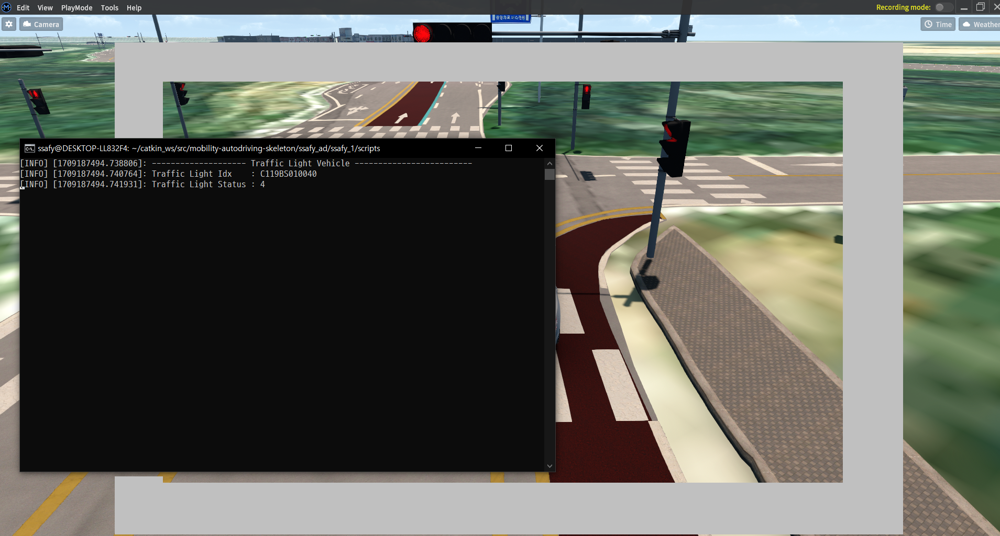

# Today I learned

시뮬레이터의 툴들로 제작된 맵의 경우 도를의 정보를 node(점), link(선)으로 나타내고 있습니다.

이를 MGEO 모드에서 확인 가능하고 여기서 해당 노드의 X,Y,Z 좌표값을 받아오지는 못합니다. 하지만 모든 오브젝트가 시뮬레이션상에서 고정 X,Y,Z 좌표값을 가지고 있는것으로 보아 특정 3차원 선을 지정하여 원하는 용도로 사용이 가능할것으로 보임

신호등의 경우에는 각 신호등에 부여된 고유 번호를 이용하여 고유 값을 받아올 수 있습니다. get_Traffic_status를 실행결과

해당 그림 처럼 차량이 있는 link에 해당하는 신호등 정보 상태정보를 자동으로 불러오는것을 확인 할 수 있습니다.