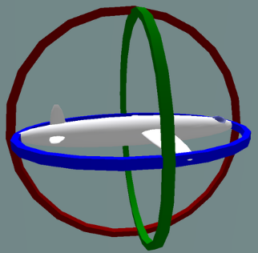
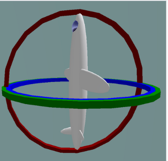

# Today I learned

오일러 각은 는 X,Y,Z의 각도 값 3개로 표현된다. 오일러 회전을 적용하기 위해 각 회전 값을 해당 축으로 기준 삼아 순차적으로 회전한다. 회전 시키는 순서에 따라 모양이 다르다.

장점
01 직관적
오일러 각은 세 각으로 구성된 직관적이고 사람이 읽기 쉽게 표시 된다.

02 180도 이상 표현 가능
오일러 각은 180도가 이상의 회전을 통해서 한 방향에서 다른 방향으로의 회전을 표현할 수 있다.

단점
3축에 대해 회전이 종속적이므로 2개의 오일러 각도 사이를 보간할 때 어느 방향으로 돌아갈지 중간 값을 결정할 수 없는 문제가 생긴다.

짐벌락 현상
짐벌 락 문제, 세 회전을 차례대로 적용하는 경우 첫 번째 또는 두 번쨰 회전의 결과로 세 번째 축이 이전 축 중 하나와 같은 방향을 가리킬 수 있다. 그러면 겹쳐버리는 현상이 발생하게 되는 것이다. 이는 세 번째 회전 값을 고유 축에 적용할 수 없어지므로 자유도(degree of freedom)가 상실된다.

 

왼쪽 사진은 x,y,z 가 독립적인 상태이고 오른쪽 사진이 두 축이 같은 방향이 되어진 GimbalLock 사진이다.

쿼터니언(Quaternion)
< w , x , y , z > = w + xi + yj + zk

쿼터니언은 x, y, z,w 로 이루어져있다. 각 성분은 3차원 벡터(x,y,z)와 스칼라 w 이다.

장점
모든 축을 한 번에 계산하기 때문에 짐벌락 문제가 발생하지 않는다.

방향과 회전을 모두 표현할 수 있다.

단점
하나의 방향에서 다른 방향으로 측정되기 때문 180도 이상의 큰 값을 표현할 수 없다.

따라서 보통 자이로 센서의 짐벌락 현상을 방지하기 위해 쿼터니언 변환하여 사용합니다.

https://choi-dan-di.github.io/computer-graphics/euler-transforms-and-quaternions/