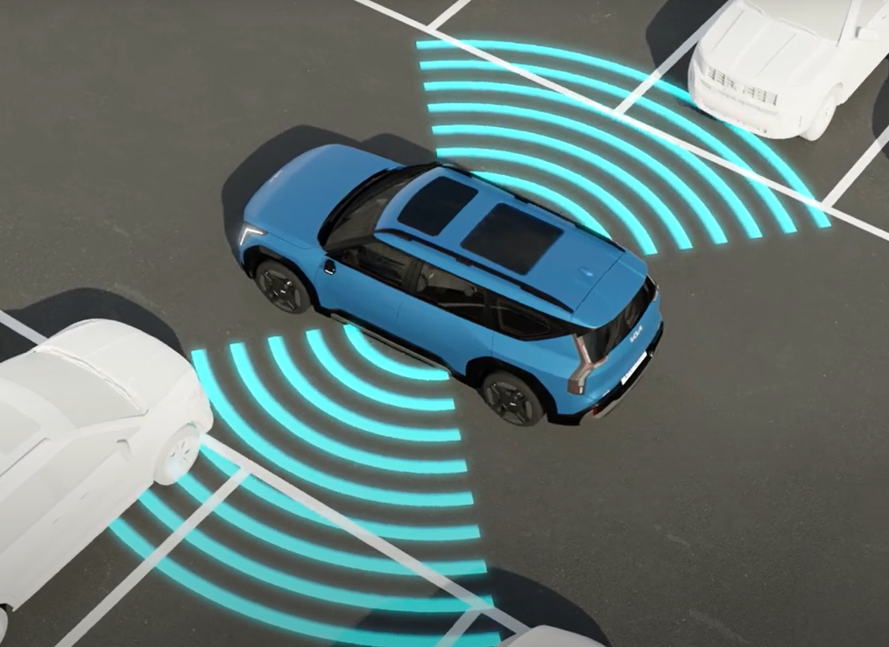

# 기획서 자료 조사

작성자: 수헌 임
최종 편집 일시: 2024년 2월 27일 오후 3:54

## 현황

### KIA 원격 스마트 주차 보조 시스템 (RSPA 2)

[기아 커넥트 스토어](https://connectstore.kia.com/kr/product/rspa2)

- 사선, 후진, 직각 주차
- 차량에 탑재된 광각 카메라와 초음파센서가 주차 공간과 주차선을 탐색
- 스마트 출차 기능 (평행 주차 상황)
- 주차 공간이 좁아 승하차의 불편함을 겪을 때, 차량 내부와 외부에서 모두 손쉽게 원격 제어로 전/후진이 가능

- **주차 과정**
    
    
    
    
    
    
- **한계점 (주차 기능이 제대로 동작하지 않는 경우)**
    - 카메라와 초음파 센서의 성능이 저하되는 환경
    - 경사가 있는 도로
    - 평평하지 않은 도로 (ex. 바닥이 자갈인 주차장)
    - 대형 차량 주변
    - 작은 기둥 주변
        
        
        
    - 좁은 주차 공간
    - 주차선이 평행하지 않은 경우
        
        
        
    - 경사진 노면
        
        
        
    - 주차선이 없을 때
    - 눈 많이 왔을 때
        
        
        
- **우리 주제와의 차이점**
    - 차량이 주차장을 자율적으로 찾아가지 못한다.
    - 출차 할 때에도 직접 차량이 주차된 곳으로 운전자가 가야한다.

이외에도 Ford, Benz 등에서 자율 주차 시스템을 도입했으며 위와 동일함.

## 기획 의도

- 미숙한 주차로 인한 사고 발생 방지
- 주차, 출차로 인한 시간 낭비 방지
    - 주차장, 주차 자리를 찾기 위해 발생하는 시간 절약
    - 주차장까지 걸어가는 시간 + 주차장에서 차량을 찾는 시간 절약
- 주차 빌런 등의 사회 문제 해결
    
    [새로운 주차 빌런 등장, 해결책은 더 비싼 차로 맞불?](https://brunch.co.kr/@b20a36d8afb0442/329)
    
    - 주차 빌런이 발생하는 원인
        - 승/하차를 편하게 하려는 이기적인 생각
            
            → 자율 출차, 주차 시스템이 상용화되면 모든 사람의 승/하차가 편해지기 때문에 문제를 해결할 수 있음
            

## 목표

- 운전자의 개입 없이 차량이 자율적으로 출차, 주차를 하는 시스템

주차

출차

## 주요 기능

1. 운전자가 하차하면 자율 주행을 통해 근처 주차장으로 이동
2. 주차할 수 있는 빈 자리 인식
3. 자율 주차 (사선, 후진, 직각)
4. 운전자가 차량을 호출하면 자율 주행을 통해 운전자 위치로 이동
5. 현재 상용화된 RSPA2와의 차별성을 위해 주차 기능이 제대로 동작하지 않는 상황 개선

## 개발 목표

### 인지 / 판단

1. 주차장 탐색
2. 주차 자리 탐색

### 제어

1. 사용자 ↔ 주차장 간 자율 주행
2. 자율 주차 기능