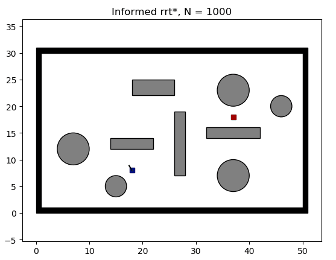
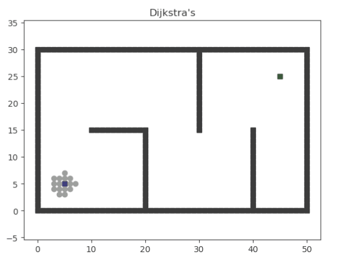

# 주차 경로 계획

## 서론

본 논문에서는 조향 함수에 따른 RRT의 주차 경로 계획 성능을 비교하고, **HC 조향 함수가 작은 추종 오차와, 작은 위치 및 방향 오차로 주차를 완료하는 경로를 계획할 수 있음**을 보인다. HC 조향 함수는, **전후진 전환 지점에서 곡률의 불연속을 고려**할 수 있고 **CC 조향 함수에 비해 적은 계산 속도**를 갖는 RS 조향 함수와 비교된다. RS와 HC 조향 함수의 특징 및 차이가 설명되며, 본 논문에서는 이를 RRT의 트리 확장 방법으로 사용하여 시뮬레이션 내 주차장 환경에서 **주차경로 계획 시간, 추종 시 cross-track 오차, 주차 성공률, 그리고 주차 목표점에서의 위치 및 방향 오차**가 측정된다.

본 논문에서는 경로 추종 제어로 **Kanayama 제어기**를 사용함

## 경로 계획

### Hybrid-A

- Configuration Space를 그리드 단위로 구성하여 차량의 구속 조건을 고려하며 경로를 탐색
- 장애물이 적은 환경에서 빠르게 주차 경로를 계획할 수 있으나 장애물이 많은 복잡한 주차장에서는 탐색 시간이 증가되는 단점이 있다.

### RRT*

- Configuration Space에서 랜덤하게 pose를 샘플링하고 트리를 확장하여 주차 경로를 계획
- 트리 확장 방법으로 **조향 함수**를 적용하여 차량의 구속 조건이 고려될 수 있음
- Configuration Space를 빠르게 탐색, 트리 확장 방법에 따라 차량의 구속 조건을 쉽게 고려할 수 있어 복잡한 주차장 환경에서 주차 경로 계획 방법으로 사용될 수 있음

### Informed RRT*

- **본 논문에서 활용되는 알고리즘**
- 초기 경로를 찾기 전까지는 RRT*와 동일하게, 랜덤 샘플링을 진행
- 초기 경로가 발견되면 시작점과 목표점, 그리고 초기 경로의 길이를 이용하여 hyper-ellipsoid subset을 정의하고, 위 subset에서만 랜덤 샘플링
- 장애물이 다양하게 존재하는 주차장과 같은 환경에서, **RRT*보다 더 짧은 경로를 빠르게 찾을 수 있음**

이 외에도 경로 계획 알고리즘에는 다익스트라, A* 등등이 있음

## 조향 함수

- **RRT**에서 **트리 확장** 방법
- 시작점에서 끝 점까지 이동하기 위한 조향각을 계산하는 함수
- **주차 경로를 계획할 때, 경로 계획 시간, 추종 성능 및 주차 성공률에 영향을 미치게 된다.**

| RS (Reeds-Shepp) | - 차량의 최소 회전 반경을 고려한 원호와 직선의 조합으로 두 pose를 연결하는 경로를 찾는 방법
- 전,후진 전환을 고려하며, 적은 계산 속도를 갖는 장점이 있어 주차 경로 계획 시 사용 |
| --- | --- |
| CC (Continuous Curvature) | - 최소 회전 반경 뿐만 아니라 최대 조향 속도까지 고려
- 클로소이드 곡선을 원호와 직선 사이에 구성하여, 원호와 직선 사이에서 곡률이 불연속인 경로를 생성하는 RS 조향 함수의 단점을 극복
- 전후진 전환 지점에서도 곡률이 연속적인 경로를 생성하여, 경로의 길이가 길어지는 단점이 있음 |
| HC (Hybrid Curvature) | - CC 조향 함수에서 전후진 전환 시, 곡률의 불연속을 허용하는 방법
- 전후진 전환 지점에서 정지 후, 차량이 조향을 변화시킬 수 있는 것을 고려할 수 있음 |

### RS (Reeds-Shepp)

### HC (Hybrid Curvature)

- HC 조향 함수는 RS 조향 함수와 다르게, 차량의 최소 회전 반경뿐만 아니라 최대 조향속도 또한 고려

## 결과 및 분석

### Informed RRT*

- HC의 경로 계획 성공률과 초기 경로 생성 시간이 RS보다 낮다.
    
    → 경로 계획 과정에서 샘플링된 pose가 사용되지 않는 경우가 RS를 사용하였을 때에 비하여 빈번하게 발생되기 때문
    
    → 논문에서는 경로 계획 시간이 제한되어 있음. HC의 긴 계산 속도로 인해 샘플의 총 개수가 감소하기 때문
    
- HC는 RS와 다르게, **차량이 충돌 없이 작은 위치 및 방향 오차로 주차를 완료하는 경로를 계획**할 수 있음

### 주차 경로 추종 결과

- HC : 100 % 성공률 / RS : 약 40% 이하 성공률
- RS는 주차 성공 시에도 HC에 비해 상대적으로 큰 위치 및 방향 오차
    
    (HC : 1cm 이하의 위치 1deg이하의 오차 발생)
    

→ 계획된 경로의 **곡률 불연속성**에 의해 발생 

## 개념

- 경로 추종 : 계획된 경로를 따라가는 것
- Configuration Space
- Pose : 현재 차량의 위치와 방향 (roll, pitch, yaw)
- 곡률
    
    
    

### 경로 계획 알고리즘 종류

1. Search based
    - 다익스트라
        
        
        
    - A*
        
        
        
    1. Sampling-based
        - RRT
            
            
            
        - RRT*
            
            
            
        
        ### RRT vs RRT*
        
        - RRT* 는 기존 RRT에서 Optimal Path를 찾도록 개선한 알고리즘
            
            [RRT star](https://sungwookyoo.github.io/study/RRT_star/)

### REFERENCE
<a name="footnote_1">[Kim, M., Ahn, J., Kim, M., Shin, M., & Park, J. (2021). 자율주차 상황에서 차량 구속 조건 고려에 따른경로 계획 및 추종 성능의 비교 분석. Journal of Korea Robotics Society, 16(3), 250-259.](http://dyros.snu.ac.kr/wp-content/uploads/2021/10/20211001_005601.pdf)</a>