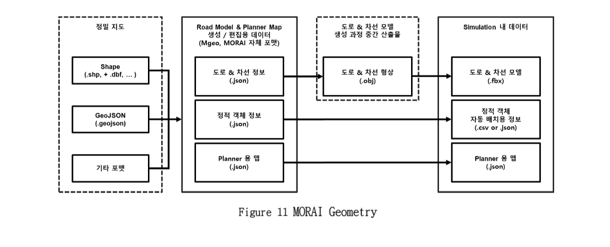
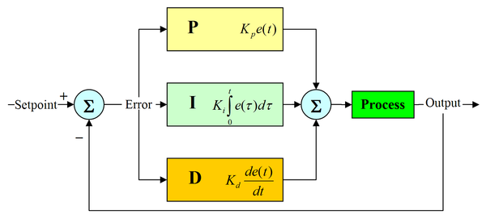
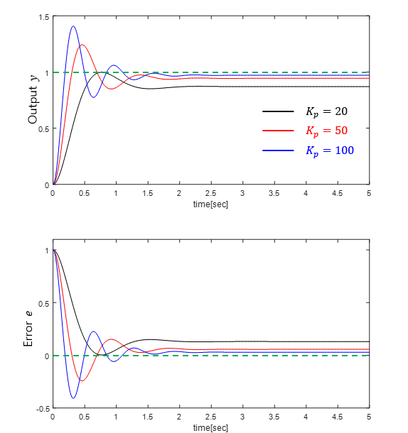
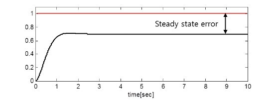
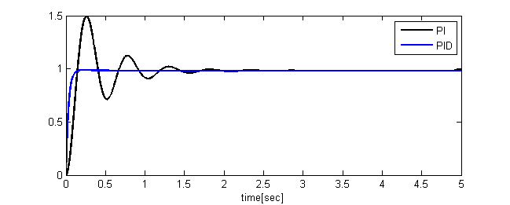
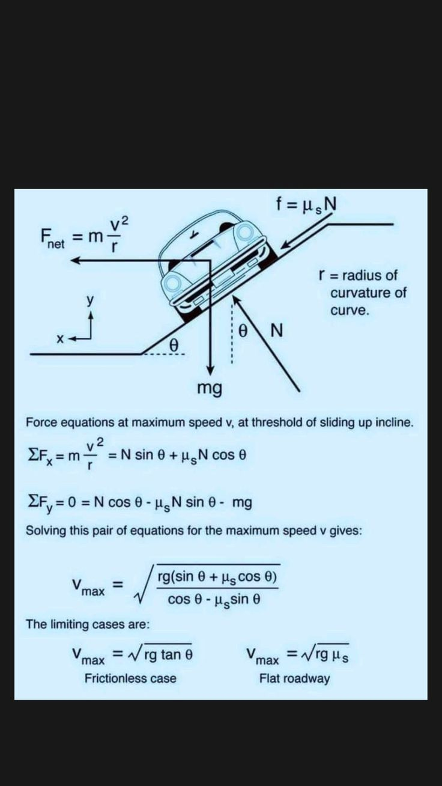

# Sub PJT 2

## 1. 좌표계
> 물체의 위치와 자세를 여러 좌표로 표현
- 직교 좌표계 : 3차원 좌표계
- 극 좌표계 : 물체의 위치를 반지름과 각도로 표현
- 원통 좌표계 : 극 좌표계 + 높이 값 (라이다에서 활용)

## 2. GPS 좌표계
- WGS84
    > GPS 데이터의 위도 경도 좌표
    - 이를 평면 좌표계로 변환하여 **2D 좌표계 기준 경로 계획**

- TM 좌표계
    > 횡축 메르카토르 도법 활용

## 3. 물체의 자세
> 기준 좌표계에서 물체가 얼마나 회전되어 있는지
- 오일러 각
    - 물체의 자세를 3축의 회전 Roll Pitch Yaw 3가지로 표현 가능
    - 몇몇 자세를 표현하지 못하는 짐벌락 현상 존재
    - 어떤 축을 먼저 회전 시키냐에 따라 계산 결과가 달라짐
      - 짐벌락 현상
          > 두 개 혹은 세 개의 축이 겹쳐서 축이 자유도를 잃고 같은 방향으로 움직임
          
          

- 쿼터니언
    > 각 축을 한꺼번에 계산하지 않기 때문에 짐벌락 현상이 발생하지 않아 어떤 회전각이든 계산 가능하고 빠른 연산 처리가 가능
    - 물체의 자세는 보통 IMU 센서에서 얻은 각속도 데이터를 통해 추정

- ROS의 TF 패키지
    > 오일러 각 <-> 쿼터니언 변환

## 4. 정밀도로 지도
> 자율주행 등에 필요한 정보를 3차원으로 제작한 전자지도
>
> 국토지리정보원에서 0.25급 해상도로 제작 및 배포 중

- 3가지 구성 요소
  - 차선
    - 규제선
    - 도로경계선
    - 정지선
    - 차로중심선
  - 도로시설
    - 중앙분리대
    - 터널
    - 교량
    - 지하차도
  - 표지시설
    - 교통안전표지
    - 노면표시
    - 신호기

- 정밀지도 활용으로 센서가 갖는 기술적 한계를 보완하여 신뢰성 있는 자율 주행 구현 가능
  - 라이다 최대 인식거리 250m

## 5. MGeo
> 시뮬레이터에서 사용되는 정밀지도 포맷

.png>)
- 형상을 표현하는 클래스
  - BasePoint : 한 개의 점으로 표현
  - BaseLine : 여러 개의 점이 모인 Line
  - BasePlane : 여러 개의 점이 모여 시작점과 끝을 연결
- 주행 경로를 표현하기 위한 데이터
  - Node : 서로 다른 두 개 이상의 Link 간의 연결 여부
  - Line : 연결성을 표현할 수 있는 선(단방향) -> Line의 전과 후 Node를 찾는다.
  - Link : 차량의 주행 경로 -> 좌 우의 Link를 찾을 수 있다. 차선 변경이 가능한 링크인지 표현

- Node & Link
  - Node
    - 필드
        - Idx : 노드 이름
        - to_links : 노드에서 나가는 링크 리스트
        - from_links : 노드로 들어오는 링크 리스트
        - on_stop_line : 정지선 여부 (True or False)
    - 메소드
        - get_to_links() : 노드에서 나가는 링크 리스트 리턴
        - get_from_links() : 노드로 들어오는 링크 리스트 리턴
        - get_to_links_idx_list() : 나가는 링크 아이디 리스트 리턴
        - get_from_links_idx_list() : 들어오는 링크 아이디 리스트 리턴
        - get_from_nodes() : 이전 연결된 노드 리스트 리턴
        - get_to_nodes() : 다음 연결될 노드 리스트 리턴
        - print_all_related_nodes_and_links() : 연결된 노드, 링크들 모두 출력_
  - Link
    - 필드
        - idx : 링크 이름
        - from_node : 링크 시작 노드
        - to_node : 링크 끝 노드
        - lazy_point_init : 차선 변경 링크 여부
        - lane_change_pair_list : 차선 변경 링크 리스트
        - max_speed_kph : 링크에서 주행할 수 있는 최대 속도
        - min_speed_kph : 링크에서 주행할 수 있는 최저 속도
        - traffic_signs : 신호등 연결된 신호등
        - traffic_lights : 받아야하는 신호등 신호
    - 메소드
        - get_to_node() : 링크 끝 노드 리턴
        - get_from_node() : 링크 시작 노드 리턴
        - get_to_links() : 나가는 링크 리스트 리턴
        - get_from_links() : 들어오는 링크 리스트 리턴
        - is_it_for_lane_change() : 차선 변경 링크인지 리턴
        - get_lane_change_pair_list() : 차선 변경할 수 있는 링크 리스트 리턴
        - get_number_of_lane_change() : 차선 변경할 수 있는 링크 개수 리턴

## 6. 경로 계획
> 차량이 주행할 경로를 만들어주는 과정
>
> 안전한 경로, 최적화된 경로 여부 고려 필요
- 전역 경로 계획
  > 전체적인 경로 계획
  
    .png>) 
- 지역 경로 계획
  > 전체 경로에서 일부분을 수정해서 주행
  
    .png>)

## 7. Dijkstra

## 8. Pure Pursuit
> 경로 위의 한 점을 원 호를 그리며 따라가는 방법

.png>)

- 자동차의 기구학과 전방주시거리 (l_d)라는 하나의 파라미터만 가지고 조향각을 간단하게 계산할 수 있어, 경로 추종에 사용하고 있는 대표적인 알고리즘 중 하나
  - 전방 주시거리는 차량의 속도에 따라 변해야 함 (속도 빠르면 멀리, 느리면 가까이 보고 운전)
  - 적절한 전방주시거리를 찾아 Overshoot을 줄이고, Saturation Time(목표 도달 시간), Lateral Error(경로 중 차량과 가장 가까운 경로점과 차량과의 직선 거리)를 줄여야 함
- 실제 자동차 모델을 단순화한 Bicycle 모델 사용

-> *Lateral Error*

## 9. PID 제어
> 원하는 값에 도달하기 위한 기초적인 자동 피드백 제어 방법 중 하나

- 수식이 간단
- 제어 대상의 모델이 필요하지 않음
- 구현 난이도 대비 목표치 추종이나 외란 감쇄 효과가 좋음
  - 외란 = 노이즈
- 목표속도, 현재속도, 오차(목표속도-현재속도)
- 오차 값을 갖고 P(비례), I(적분), D(미분)을 통해 현재 값을 목표 값으로 수렴시킴
- 원하는 성능을 얻기 위해서는 P,I,D 이득 값을 적절히 튜닝하는 과정 필요
- 적절한 이득 값을 찾지 못하면 시간이 지나도 오차 값이 계속 남아있거나, 목표 값에서 더 멀어져서 시스템이 매우 불안정해짐

---

### 비례항 (P) : 오차 값의 크기에 비례한 제어 작용

-> *P 제어기의 계수에 따른 시스템의 출력과 error*
  - Kp가 너무 작으면 응답속도가 느리고 정상상태에 도달하지 못하게 됩니다. 반대로 Kp가 너무 크면 응답속도는 빠르지만 오버슈트가 발생하여 오실레이션이 발생

---

### 적분항 (I) : 정상상태(steady-state) 오차를 없애는 작용

  - K_p가 아무리 크더라도 아주 조금의 오차 발생 (K_p는 고정값이기 때문에 목표값에 가까워질수록 제어기 출력이 작아짐 -> 세밀한 제어가 불가능함)
  - 시간이 0일 때부터 나타낸 error들을 모두 반영해서 시스템 제어 입력 값 결정
  - 목표값을 끝까지 잘 추종할 수 있도록 함

---

### 미분항 (D) : 출력값의 급격한 변화에 제동을 걸어 Overshoot을 줄이고 안정성(Stability)을 향상
  

  - error의 미분 값 음수 (error의 가파른 변화 => D 게인의 영향이 커진다.)

## 10. 경로기반 속도 계획
> 곡선 주행 시 구심력의 작용 반작용 힘에 의해 차량은 원심력을 받음.
> 
> 이 힘은 회전반경에 반비례, 속도의 제곱에 비례하기 때문에 속도가 클 수록, 회전반경이 작을수록 차량이 쉽게 전복됨
>
> 따라서 경로기반 속도 계획을 통해 차량 전복 방지

곡률 기반 최대속도 유지식 (명세서에서는 오른쪽 아래 Flat roadway일 때를 설명)

- u_s : 운동마찰계수 (시물레이터 환경에 맞게 조절, 아스팔트 0.7~0.8)

- 경로의 곡률반지름(r)을 알아야 함
  - **최소 자승법**
    > 경로점들을 활용해 경로와 최대한 근사한 모델 (원의 방정식 또는 3차 방정식)을 만듬

## 11. ACC (Adaptive Cruise Control)
> 센서로 앞 차를 인지하고 앞 차와의 간격을 유지하는 시스템

### 고전적인 ACC 모듈

.png>)

- Speed Control 모드 : 상대거리 > 안전거리
- Spacing Control 모드 : 상대거리 < 안전거리
- D_safe : 안전거리
- defaultSpace : 기본 유지 거리
- timegap : 판단에서 제어까지 차량을 안전하게 멈추는 시간
- V_rel : 상대 속도
- D_rel : 상대 거리
- gain_vel : 속도에 대한 이득 값
- gain_dis : 거리에 대한 이득 값
- 앞 차와의 급격한 속도 변화에도 D_rel이 D_safe와 같게 유지하는 것이 목표
- 앞 차 뿐만 아니라 보행자, 정지선, 장애물에도 적용 가능