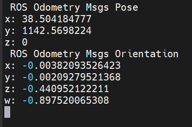
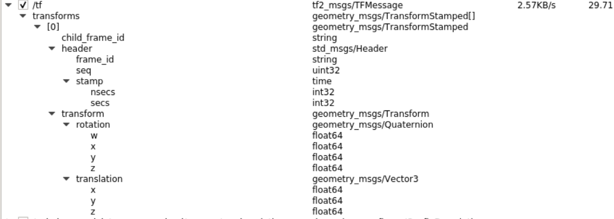
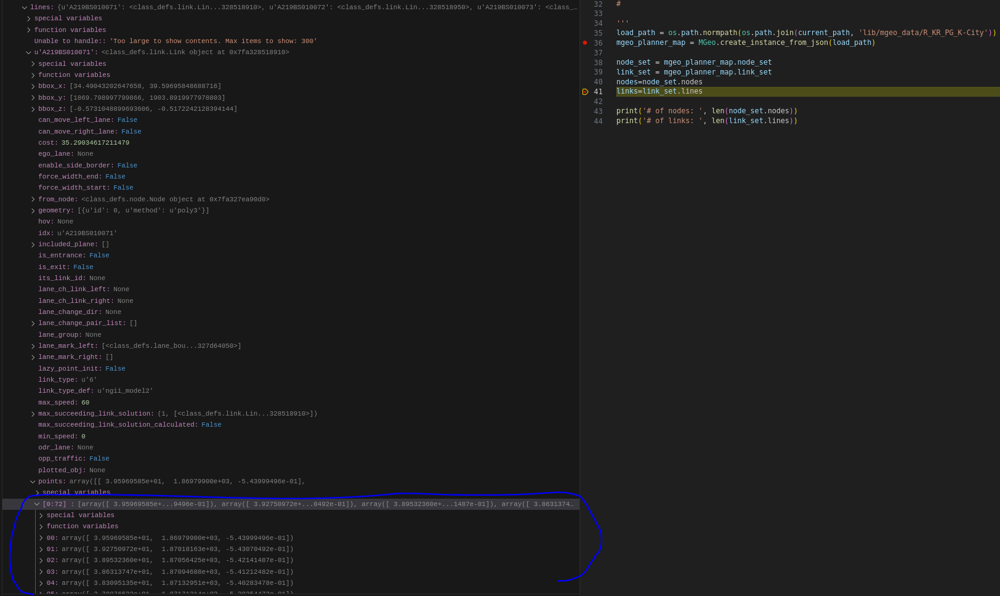

# Sub PJT 2 실습
- [Sub PJT 2 실습](#sub-pjt-2-실습)
  - [1. gps\_parser.py](#1-gps_parserpy)
    - [이슈](#이슈)
    - [코드](#코드)
    - [실행결과](#실행결과)
  - [2. gpsimu\_parser.py](#2-gpsimu_parserpy)
    - [코드](#코드-1)
    - [실행결과](#실행결과-1)
  - [3. tf\_pub.py](#3-tf_pubpy)
    - [코드](#코드-2)
    - [실행결과](#실행결과-2)
  - [4. mgeo\_pub.py](#4-mgeo_pubpy)
    - [이슈](#이슈-1)
    - [코드](#코드-3)
    - [실행 결과](#실행-결과)


## 1. gps_parser.py
> 시뮬레이터에서 출력되는 GPS 센서 데이터를 받아 UTM으로 변환 (Pyproj 라이브러리 활용)
### 이슈
```python
xy_zone = self.proj_UTM(self.lat, self.lon) 가 아니라
xy_zone = self.proj_UTM(self.lon, self.lat) 해야함
```

### 코드
```python
#!/usr/bin/env python
# -*- coding: utf-8 -*-

import rospy
import numpy as np
import tf
import os
#TODO: (0) pyproj 라이브러리 Import [ pip install pyproj ]
from pyproj import Proj
from std_msgs.msg import Float32MultiArray
from morai_msgs.msg import GPSMessage, EgoVehicleStatus

# gps_parser 는 GPS의 위경도 데이터를 UTM 좌표로 변환하는 예제입니다.
# Pyproj 라이브러리를 사용 

# 노드 실행 순서 
# 1. 변환 하고자 하는 좌표계를 선언  
# 2. 시뮬레이터에서 GPS 데이터를 받아오는 Callback 함수 생성 
# 3. 위도 경도 데이터를 UTM 좌표로 변환   
# 4. 위도 경도 데이터와 변환한 UTM 좌표를 터미널 창에 출력 하여 확인  

class LL2UTMConverter:
    def __init__(self, zone=10) :
        self.gps_sub = rospy.Subscriber('/gps', GPSMessage, self.navsat_callback)
        # 초기화
        self.x, self.y = None, None

        #TODO: (1) 변환 하고자 하는 좌표계를 선언
        '''
        # GPS 센서에서 수신되는 위도, 경도 데이터를 UTM 좌표료 변환 하기 위한 예제이다.
        # 해당 예제는 WGS84 좌표계에서 UTM 좌표계로의 변환을 진행한다.
        # 시뮬레이터 K-City Map 의 경우 UTM 좌표계를 사용하며 실제 지도 상 위치는 UTM 좌표계의 52 Zone 에 존재한다.
        # 맵 좌표계는 m 단위를 사용한다.
        # 아래 주소의 링크를 클릭하여 Ptoj 의 사용 방법을 확인한다.
        # https://pyproj4.github.io/pyproj/stable/api/proj.html
        # " proj= , zone= , ellps =  , preserve_units = "
        self.proj_UTM = Proj(proj= , zone= , ellps =  , preserve_units =)

        '''
        self.proj_UTM = Proj(proj= 'utm', zone=52 , ellps ='WGS84' , preserve_units =False)

    #TODO: (2) 시뮬레이터에서 GPS 데이터를 받아오는 Callback 함수 생성
    def navsat_callback(self, gps_msg):
        '''
        GPS 센서에서 수신되는 위도 경도 데이터를 확인한다.
        self.lat = 
        self.lon = 

        '''
        self.lat = gps_msg.latitude
        self.lon = gps_msg.longitude
        self.convertLL2UTM()

        utm_msg = Float32MultiArray()

        #TODO: (4) 위도 경도 데이터와 변환한 UTM 좌표를 터미널 창에 출력 하여 확인
        '''
        UTM 으로 변환 된 좌표 데이터와 위도 경도 데이터를 터미널 창에 출력되도록 한다.
        utm_msg.data = [self.x, self.y]
        os.system('clear')
        print(' lat : ', 위도 데이터)
        print(' lon : ', 경도 데이터)
        print(' utm X : ', utm 좌표로 변환한 x 좌표)
        print(' utm Y : ', utm 좌표로 변환한 y 좌표)

        '''
        utm_msg.data = [self.x, self.y]
        os.system('clear')
        print(' lat : ', self.lat)
        print(' lon : ', self.lon)
        print(' utm X : ', utm_msg.data[0])
        print(' utm Y : ', self.y)

    #TODO: (3) 위도 경도 데이터를 UTM 좌표로 변환
    def convertLL2UTM(self):
        '''
        # pyproj 라이브러리를 이용해 정의한 좌표 변환 변수를 이용하여 위 경도 데이터를 변환한다.
        xy_zone = self.proj_UTM(위도 데이터, 경도 데이터)

        self.x = xy_zone[0]
        self.y = xy_zone[1]

        '''
        xy_zone = self.proj_UTM(self.lon, self.lat)

        self.x = xy_zone[0]
        self.y = xy_zone[1]


if __name__ == '__main__':

    rospy.init_node('gps_parser', anonymous=True)
    gps_parser = LL2UTMConverter()

    rospy.spin()
        

```
### 실행결과


## 2. gpsimu_parser.py
- frame_id
  > 해당 메시지가 어떤 frame에 속해있는지를 의미함
- frame
  > 좌표계의 이름
  - base_link : 로봇(자동차) 자체의 위치를 나타내는 frame

https://velog.io/@7cmdehdrb/whatIsTF |
https://velog.io/@bbolddagu/ROS2-Odometry 참고


### 코드
```python
#!/usr/bin/env python
# -*- coding: utf-8 -*-
 
import rospy
import tf
import os
from std_msgs.msg import Float32MultiArray
from sensor_msgs.msg import Imu
from morai_msgs.msg import GPSMessage
from nav_msgs.msg import Odometry
from pyproj import Proj
from math import pi

# gpsimu_parser 는 GPS, IMU 센서 데이터를 받아 차량의 상대위치를 추정하는 예제입니다.

# 노드 실행 순서 
# 1. 변환 하고자 하는 좌표계를 선언
# 2. 송신 될 Odometry 메세지 변수 생성
# 3. 위도 경도 데이터 UTM 죄표로 변환
# 4. Odometry 메세지 변수에 차량의 위치 및 상태 데이터 담기
# 5. Odometry 메세지 Publish

class GPSIMUParser:
    def __init__(self):
        rospy.init_node('GPS_IMU_parser', anonymous=True)
        self.gps_sub = rospy.Subscriber("/gps", GPSMessage, self.navsat_callback)
        self.imu_sub = rospy.Subscriber("/imu", Imu, self.imu_callback)
        self.odom_pub = rospy.Publisher('/odom',Odometry, queue_size=1)
        # 초기화
        self.x, self.y = None, None
        self.is_imu=False
        self.is_gps=False

        #TODO: (1) 변환 하고자 하는 좌표계를 선언
        '''
        # GPS 센서에서 수신되는 위도, 경도 데이터를 UTM 좌표료 변환 하기 위한 예제이다.
        # 해당 예제는 WGS84 좌표계에서 UTM 좌표계로의 변환을 진행한다.
        # 시뮬레이터 K-City Map 의 경우 UTM 좌표계를 사용하며 실제 지도 상 위치는 UTM 좌표계의 52 Zone 에 존제한다.
        # 맵 좌표계는 m 단위를 사용한다.
        # 아래 주소의 링크를 클릭하여 Ptoj 의 사용 방법을 확인한다.
        # https://pyproj4.github.io/pyproj/stable/api/proj.html
        # " proj= , zone= , ellps =  , preserve_units = "
        self.proj_UTM = Proj( 좌표 변환을 위한 변수 입력 )

        '''
        self.proj_UTM = Proj(proj= 'utm', zone=52 , ellps ='WGS84' , preserve_units =False)

        #TODO: (2) 송신 될 Odometry 메세지 변수 생성
        '''
        # ROS 메세지 중 물체의 위치와 자세 데이터를 나타내는 Odometry 메세지를 사용한다.
        # 차량의 현재 위치와 자세 데이터를 GPS IMU 센서에 담아서 Publsih 한다.
        # 이때 frame_id 는 '/odom' child_frame_id 는 '/base_link' 로 한다.

        self.odom_msg = 
        self.odom_msg.header.frame_id = 
        self.odom_msg.child_frame_id = 

        '''
        self.odom_msg = Odometry()
        self.odom_msg.header.frame_id = '/odom'
        self.odom_msg.child_frame_id = '/base_link'

        rate = rospy.Rate(30) # 30hz
        while not rospy.is_shutdown():
            if self.is_imu==True and self.is_gps == True:
                self.convertLL2UTM()

                #TODO: (5) Odometry 메세지 Publish
                '''
                # Odometry 메세지 를 전송하는 publisher 를 만든다.
                self.odom_pub.
                
                '''
                self.odom_pub.publish(self.odom_msg)

                os.system('clear')
                print(" ROS Odometry Msgs Pose ")
                print(self.odom_msg.pose.pose.position)
                print(" ROS Odometry Msgs Orientation ")
                print(self.odom_msg.pose.pose.orientation)

                rate.sleep()

    def navsat_callback(self, gps_msg):

        self.lat = gps_msg.latitude
        self.lon = gps_msg.longitude
        self.e_o = gps_msg.eastOffset
        self.n_o = gps_msg.northOffset

        self.is_gps=True

    #TODO: (3) 위도 경도 데이터 UTM 죄표로 변환
    def convertLL2UTM(self):
        '''
        # pyproj 라이브러리를 이용해 정의한 좌표 변환 변수를 이용하여 위 경도 데이터를 변환한다.
        # 변환 시 이전 gps_parser.py 예제와 달리 시뮬레이터 GPS 센서의 offset 값을 적용 한다.
        # GPS 센서에서 출력되는 Offset 값은 시뮬레이터에 맵 좌표계로 변경을 위한 값이다.
        # UTM 좌표로 변환 된 x, y 값에 offset 값을 빼주면 된다.
        xy_zone = self.proj_UTM(위도 데이터, 경도 데이터)

        # if 문을 이용 예외처리를 하는 이유는 시뮬레이터 음영 구간 설정 센서 데이터가 0.0 으로 나오기 때문이다.
        if self.lon == 0 and self.lat == 0:
            self.x = 0.0
            self.y = 0.0
        else:
            self.x = xy_zone[0] - self.e_o
            self.y = xy_zone[1] - self.n_o

        '''
        
        # UTM 좌표로 변환 된 x, y 값에 offset 값을 빼주면 된다.
        xy_zone = self.proj_UTM(self.lon, self.lat)

        # if 문을 이용 예외처리를 하는 이유는 시뮬레이터 음영 구간 설정 센서 데이터가 0.0 으로 나오기 때문이다.
        if self.lon == 0 and self.lat == 0:
            self.x = 0.0
            self.y = 0.0
        else:
            self.x = xy_zone[0] - self.e_o
            self.y = xy_zone[1] - self.n_o

        #TODO: (4) Odometry 메세지 변수에 차량의 위치 및 상태 데이터 담기
        '''
        # Offset 을 적용하여 시뮬레이터 맵 좌표계 값으로 변환 된 좌표 데이터를 Odometry 메세지에 넣는다.
        self.odom_msg.header.stamp = rospy.get_rostime()
        self.odom_msg.pose.pose.position.x = 
        self.odom_msg.pose.pose.position.y = 
        self.odom_msg.pose.pose.position.z =

        '''
        self.odom_msg.header.stamp = rospy.get_rostime()
        self.odom_msg.pose.pose.position.x = self.x
        self.odom_msg.pose.pose.position.y = self.y
        self.odom_msg.pose.pose.position.z = 0

    def imu_callback(self, data):

        #TODO: (4) Odometry 메세지 변수에 차량의 위치 및 상태 데이터 담기
        '''
        # IMU 를 통해 받은 물체의 자세 데이터를 Odometry 메세지에 넣는다.
        # if 문을 이용 예외처리를 하는 이유는 시뮬레이터 음영 구간 설정 센서 데이터가 0.0 으로 나오기 때문이다.
        if data.orientation.w == 0:
            self.odom_msg.pose.pose.orientation.x = 0.0
            self.odom_msg.pose.pose.orientation.y = 0.0
            self.odom_msg.pose.pose.orientation.z = 0.0
            self.odom_msg.pose.pose.orientation.w = 1.0
        else:
            self.odom_msg.pose.pose.orientation.x = data.orientation.x
            self.odom_msg.pose.pose.orientation.y = data.orientation.y
            self.odom_msg.pose.pose.orientation.z = data.orientation.z
            self.odom_msg.pose.pose.orientation.w = data.orientation.w

        '''
        if data.orientation.w == 0:
            self.odom_msg.pose.pose.orientation.x = 0.0
            self.odom_msg.pose.pose.orientation.y = 0.0
            self.odom_msg.pose.pose.orientation.z = 0.0
            self.odom_msg.pose.pose.orientation.w = 1.0
        else:
            self.odom_msg.pose.pose.orientation.x = data.orientation.x
            self.odom_msg.pose.pose.orientation.y = data.orientation.y
            self.odom_msg.pose.pose.orientation.z = data.orientation.z
            self.odom_msg.pose.pose.orientation.w = data.orientation.w
        self.is_imu=True

if __name__ == '__main__':
    try:
        GPS_IMU_parser = GPSIMUParser()
    except rospy.ROSInterruptException:
        pass

```
### 실행결과


## 3. tf_pub.py
- TF : ROS에서 각각의 좌표계끼리의 관계를 정의

https://velog.io/@7cmdehdrb/whatIsTF 참고

### 코드
실행 전에 아래와 같이 설정
```bash
$ rosrun ssafy_2 gpsimu_parser.py
$ rqt -> rqt 실행
```


```python
#!/usr/bin/env python
# -*- coding: utf-8 -*-
import rospy
import tf
from math import pi
from nav_msgs.msg import Odometry

# tf 는 물체의 위치와 자세 데이터를 좌표계로 나타내는 예제입니다.

# 노드 실행 순서 
# 1. Callback 함수 생성
# 2. 브로드캐스터 생성 및 Ego 상태 tf 브로드캐스팅

class Ego_listener():
    def __init__(self):
        rospy.init_node('status_listener', anonymous=True)
        
        rospy.Subscriber("/odom", Odometry, self.odom_callback)
        rospy.spin()


    #TODO: (1) Callback 함수 생성
    def odom_callback(self,msg):
        self.is_odom = True

        '''
        # gpsimu_parser.py 예제에서 Publish 해주는 Odometry 메세지 데이터를 Subscrib 한다.
        # Odometry 메세지 에 담긴 물체의 위치 와 자세 데이터를 아래 변수에 넣어준다.
        self.x = 물체의 x 좌표 
        self.y = 물체의 y 좌표

        self.orientation_x = 물체의 quaternion x 값 
        self.orientation_y = 물체의 quaternion y 값
        self.orientation_z = 물체의 quaternion z 값
        self.orientation_w = 물체의 quaternion ㅈ 값

        '''
        self.x = msg.pose.pose.position.x
        self.y = msg.pose.pose.position.y

        self.orientation_x = msg.pose.pose.orientation.x
        self.orientation_y = msg.pose.pose.orientation.y
        self.orientation_z = msg.pose.pose.orientation.z
        self.orientation_w = msg.pose.pose.orientation.w

        #TODO: (2) 브로드캐스터 생성 및 Ego 상태 tf 브로드캐스팅
        '''
        # TF 데이터를 broadcast 해주는 변수를 선언한다.
        # TF 데이터에 물체의 좌표와 자세 데이터를 시간 그리고 Frame ID 를 넣어주면 된다.
        # TF 예제는 map 좌표 를 기준으로 Ego 차량의 위치를 좌표를 나타낸다
        br = tf.TransformBroadcaster()
        br.sendTransform((x 좌표, y 좌표, z 좌표),
                        (물체의 quaternion x 값,물체의 quaternion y 값,물체의 quaternion z 값,물체의 quaternion w 값),
                        rospy.Time.now(),
                        "Ego",
                        "map")

        '''
        print('tf broad cast')
        br = tf.TransformBroadcaster()
        br.sendTransform((self.x, self.y, 0),
                        (self.orientation_x,self.orientation_y,self.orientation_z,self.orientation_w),
                        rospy.Time.now(),
                        "Ego",
                        "map")


if __name__ == '__main__':
    try:
        tl=Ego_listener()
    except rospy.ROSInternalException:
        pass

```

### 실행결과

## 4. mgeo_pub.py
### 이슈
- rviz 실행 이슈 해결 방법 (Segmentation Fault)
  ```bash
    $ echo "export DISPLAY=:0" >> ~/.bashrc
    $ source ~/.bashrc
    $ echo 'export LIBGL_ALWAYS_INDIRECT=0' >> ~/.bashrc
    $ source ~/.bashrc
  ```
  https://github.com/ros-visualization/rviz/issues/1438 참고

- 데이터 확인
  - vscode에서 기존 debugger 지우고 Debugpy Old extensions 설치
  - vscode로 mgeo 디버그

 | 


### 코드
```python
#!/usr/bin/env python
# -*- coding: utf-8 -*-

import os
import sys
import rospy

from nav_msgs.msg import Path
from geometry_msgs.msg import PoseStamped,Point32
from sensor_msgs.msg import PointCloud

current_path = os.path.dirname(os.path.realpath(__file__))
sys.path.append(current_path)

from lib.mgeo.class_defs import *

# mgeo_pub 은 Mgeo 데이터를 읽어온 뒤 도로 정보를 Point Cloud Data 로 변환하는 예제입니다.
# Point Cloud 형식으로 변환 후 Rviz 를 이용해 정밀도로지도 데이터를 시각화 할 수 있습니다.

# 노드 실행 순서 
# 1. Mgeo data 읽어온 후 데이터 확인
# 2. Link 정보 Point Cloud 데이터로 변환
# 3. Node 정보 Point Cloud 데이터로 변환
# 4. 변환한 Link, Node 정보 Publish

class get_mgeo :
    def __init__(self):
        rospy.init_node('test', anonymous=True)
        self.link_pub = rospy.Publisher('link',PointCloud, queue_size=1)
        self.node_pub = rospy.Publisher('node',PointCloud, queue_size=1)

        #TODO: (1) Mgeo data 읽어온 후 데이터 확인
        '''
        # Json 파일 형식으로 저장된 MGeo 데이터를 읽어오는 예제 입니다.
        # VScode 의 debug 기능을 이용하여 MGeo 데이터를 확인 할 수 있습니다.
        # MGeo 데이터는 인접 리스트 방식의 그래프 구조 입니다.
        # 정밀도로지도의 도로 간의 연결 관계를 표현 합니다.
        # MGeo 에는 도로의 형상을 나타내는 Node 와 Link 데이터가 있습니다.
        # Node 와 Link 는 모두 Point 데이터 들의 집합입니다.
        # Node 는 서로 다른 두개 이상의 Link 간의 연결 여부를 나타냅니다.
        # Link 는 도로를 표현하며 도로 의 중심 선이 됩니다.
        # Link 와 Node 정보가 모여 도로의 형상을 표현합니다.
        # 각각의 Node Link 정보는 이름인 idx 정보를 가집니다 idx 는 중복 될 수 없습니다. 
        # to_links , from_links , to_node , from_node ... 등 
        # MGeo에 정의되어 있는 데이터를 활용해 각 Node 와 Link 간 연결 성을 나타낼 수 있습니다.
        
        '''
        load_path = os.path.normpath(os.path.join(current_path, 'lib/mgeo_data/R_KR_PG_K-City'))
        mgeo_planner_map = MGeo.create_instance_from_json(load_path)

        node_set = mgeo_planner_map.node_set
        link_set = mgeo_planner_map.link_set

        self.nodes=node_set.nodes
        self.links=link_set.lines

        self.link_msg=self.getAllLinks()
        self.node_msg=self.getAllNode()

        # print('# of nodes: ', len(node_set.nodes))
        # print('# of links: ', len(link_set.lines))

        rate = rospy.Rate(1) 
        while not rospy.is_shutdown():

            #TODO: (4) 변환한 Link, Node 정보 Publish
            '''
            # 변환한 Link, Node 정보 를 전송하는 publisher 를 만든다.
            self.link_pub.
            self.node_pub.
            
            '''
            self.link_pub.publish(self.link_msg)
            self.node_pub.publish(self.node_msg)
                
            rate.sleep()


    def getAllLinks(self):
        all_link=PointCloud()
        all_link.header.frame_id='map'

        #TODO: (2) Link 정보 Point Cloud 데이터로 변환
        '''
        # Point Cloud 형식으로 Link 의 좌표 정보를 변환합니다.
        # Link 의 개수 만큼 반복하는 반복 문을 이용해 Link 정보를 Point Cloud 형식 데이터에 넣습니다.

        for link_idx in self.links :
            for  in :

        
        '''
        for lines in self.links.values() :
          for point in lines.points :
            pt = Point32()
            pt.x = point[0]
            pt.y = point[1]
            pt.z = point[2]
            all_link.points.append(pt)

        return all_link
    
    def getAllNode(self):
        all_node=PointCloud()
        all_node.header.frame_id='map'

        #TODO: (3) Node 정보 Point Cloud 데이터로 변환
        '''
        # Point Cloud 형식으로 Node 의 좌표 정보를 변환합니다.
        # Node 의 개수 만큼 반복하는 반복 문을 이용해 Node 정보를 Point Cloud 형식 데이터에 넣습니다.

        for node_idx in self.nodes :

        '''
        for nodes in self.nodes.values() :
          pt = Point32()
          pt.x = nodes.point[0]
          pt.y = nodes.point[1]
          pt.z = nodes.point[2]
          all_node.points.append(pt)

        return all_node


if __name__ == '__main__':
    
    test_track=get_mgeo()


```

### 실행 결과
