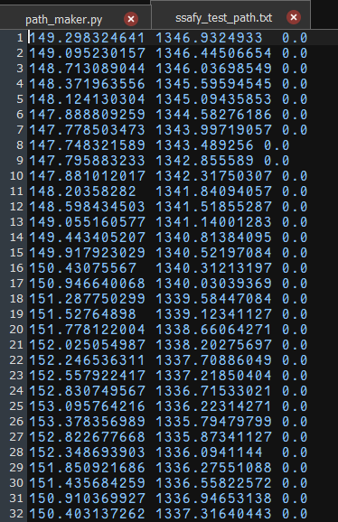
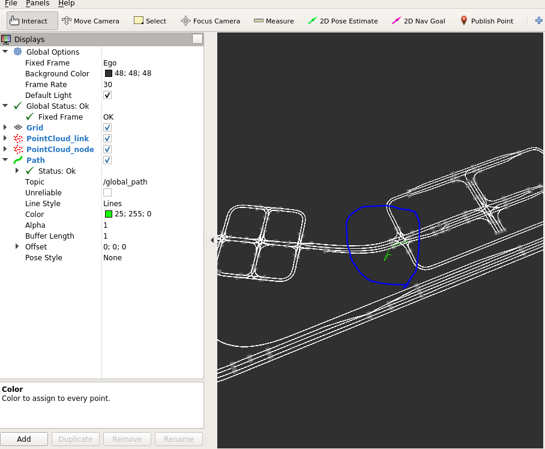
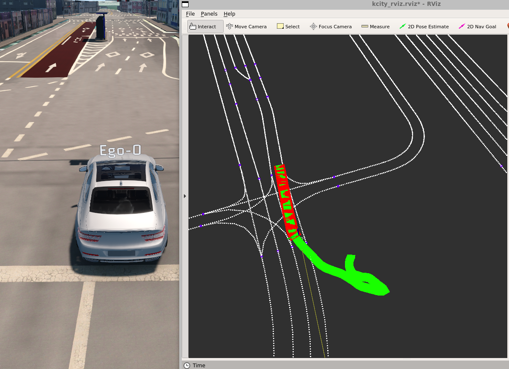

# Sub PJT 2 실습2
## 목차
- [Sub PJT 2 실습2](#sub-pjt-2-실습2)
  - [목차](#목차)
  - [5. path\_maker.py](#5-path_makerpy)
    - [코드](#코드)
    - [실행결과](#실행결과)
  - [6. global\_path\_pub.py](#6-global_path_pubpy)
    - [코드](#코드-1)
    - [실행 결과](#실행-결과)
  - [7. local\_path\_pub.py](#7-local_path_pubpy)
    - [코드](#코드-2)
    - [실행 결과](#실행-결과-1)


## 5. path_maker.py
> 차량의 위치 데이터를 txt 파일로 저장
>
> 저장된 파일은 차량의 주행 경로가 됨

### 코드
```python
#!/usr/bin/env python
# -*- coding: utf-8 -*-
from re import I
import rospy
import rospkg
from math import sqrt, hypot
from geometry_msgs.msg import Point32,PoseStamped
from nav_msgs.msg import Odometry

# path_maker 는 차량의 위치 데이터를 받아 txt 파일로 저장하는 예제입니다.
# 저장한 txt 파일은 차량의 주행 경로가 되며 경로 계획에 이용 할 수 있습니다.

# 노드 실행 순서 
# 1. 저장할 경로 및 텍스트파일 이름을 정하고, 쓰기 모드로 열기
# 2. 콜백함수에서 처음 메시지가 들어오면 초기 위치를 저장
# 3. 콜백함수에서 이전 위치와 현재 위치의 거리 계산
# 4. 이전 위치보다 0.5m 이상일 때 위치를 저장

class pathMaker :    
    def __init__(self, pkg_name = 'ssafy_2', path_name = 'make_path'):
        rospy.init_node('path_maker', anonymous=True)

        rospy.Subscriber("/odom", Odometry, self.odom_callback)

        # 초기화
        self.prev_x = 0
        self.prev_y = 0
        self.is_odom=False

        #TODO: (1) 저장할 경로 및 텍스트파일 이름을 정하고, 쓰기 모드로 열기
        '''
        # Path 데이터를 기록 하고 저장 할 경로와 txt 파일의 이름을 정한다.
        # 이후 쓰기 모드로 연다.
        # pkg_name 과 path_name 은 22 번 줄 참고한다.
        rospack = rospkg.RosPack()
        pkg_path = rospack.get_path(pkg_name)
        full_path = 이곳에 txt 파일이 저장될 경로와 이름을 적는다
        self.f = 

        '''
        rospack = rospkg.RosPack()
        pkg_path = rospack.get_path(pkg_name)
        full_path = pkg_path + '/path/ssafy_test_path.txt'
        # 파일 이름 = ssafy_test_path.txt
        self.f = open(full_path, 'w')
        
        
        
        while not rospy.is_shutdown():
            if self.is_odom == True :
                # Ego 위치 기록
                self.path_make()
        self.f.close()

    def path_make(self):
        x = self.x
        y = self.y
        z = 0.0
        #TODO: (3) 콜백함수에서 이전 위치와 현재 위치의 거리 계산
        '''
        # 현재 차량의 위치와 이전에 지나온 위치의 좌표 데이터를 구한다.
        # 구해진 좌표 사이의 거리를 계산한다.
        # 이전 위치 좌표는 아래 #TODO: (4)에서 정의 한다.
        distance = 

        '''
        
        distance = sqrt((x-self.prev_x)**2 + (y - self.prev_y) ** 2)

        #TODO: (4) 이전 위치보다 0.5m 이상일 때 위치를 저장        
        if distance >0.5:
            '''
            # distance 가 0.5 보다 커야지만 동작한다.
            # 현재 위치 좌표를 data 에 담은 뒤 txt 파일로 작성한다.
            # data 는 문자열 이며 x y z 사이는 \t 로 구분한다
            data ='{0}\t{1}\t{2}\n'.format(x,y,z)
            self.f.write(data 변수를 넣는 위치이다)
            self.prev_x = 
            self.prev_y = 
            self.prev_z = 
            
            print(기록 된 위치 좌표를 출력한다)

            '''
            data ='{0}\t{1}\t{2}\n'.format(x, y, z)
            self.f.write(data)  # data를 파일에 작성
            self.prev_x = x
            self.prev_y = y
            self.prev_z = z  # 이전 위치 업데이트
            
            print('Recorded Position:', x, y, z)  # 기록된 위치 출력

    def odom_callback(self,msg):
        self.is_odom = True
        #TODO: (2) 콜백함수에서 처음 메시지가 들어오면 초기 위치를 저장

        '''
        # gpsimu_parser.py 예제에서 Publish 해주는 Odometry 메세지 데이터를 Subscrib 한다.
        # Odometry 메세지 에 담긴 물체의 위치 데이터를 아래 변수에 넣어준다.
        self.x = 물체의 x 좌표 
        self.y = 물체의 y 좌표

        '''
        self.x = msg.pose.pose.position.x
        self.y = msg.pose.pose.position.y
if __name__ == '__main__' :
    try:
        p_m=pathMaker()
    except rospy.ROSInternalException:
        pass
            
```


### 실행결과


## 6. global_path_pub.py
> txt 파일의 경로를 읽어와서 Publish

- gpsimu, tf, mgeo_pub, global_path_pub 실행 후 rviz 실행

### 코드
```python
#!/usr/bin/env python
# -*- coding: utf-8 -*-

import rospy
import rospkg
from math import cos,sin,pi,sqrt,pow
from geometry_msgs.msg import Point32,PoseStamped
from nav_msgs.msg import Odometry,Path

# global_path_pub 은 txt 파일로 저장한 Path 데이터를 global Path (전역경로) 로 읽어오는 예제입니다.
# 만들어진 global Path(전역경로) 는 Local Path (지역경로) 를 만드는데 사용 된다.

# 노드 실행 순서 
# 1. Global Path publisher 선언 및 Global Path 변수 생성 
# 2. 읽어올 경로 의 텍스트파일 이름을 정하고, 읽기 모드로 열기
# 3. 읽어 온 경로 데이터를 Global Path 변수에 넣기
# 4. Global Path 정보 Publish


class global_path_pub :
    def __init__(self, pkg_name = 'ssafy_2', path_name = 'kcity'):
        rospy.init_node('global_path_pub', anonymous = True)

        #TODO: (1) Global Path publisher 선언 및 Global Path 변수 생성 
        '''
        # Global Path 데이터를 Publish 하는 변수와 메세지를 담고있는 변수를 선언한다.
        # 이때 Global Path 는 map 좌표계를 기준으로 생성한다.
        self.global_path_pub = 
        self.global_path_msg = 
        self.global_path_msg.header.frame_id = 

        '''
        self.global_path_pub = rospy.Publisher('global_path', Path, queue_size=10) 
        self.global_path_msg = Path()
        self.global_path_msg.header.frame_id = 'map'
        
        
        #TODO: (2) 읽어올 경로 의 텍스트파일 이름을 정하고, 읽기 모드로 열기
        '''
        # Path 데이터가 기록 된 txt 파일의 경로와 이름을 정한다.
        # 이후 읽기 모드로 연다.
        # pkg_name 과 path_name 은 21 번 줄 참고한다.
        rospack = rospkg.RosPack()
        pkg_path = rospack.get_path(pkg_name)
        full_path = 
        self.f =         
        lines = self.f.readlines()

        '''
        rospack = rospkg.RosPack()
        pkg_path = rospack.get_path(pkg_name)
        full_path = pkg_path + '/path/kcity.txt'
        self.f = open(full_path, 'r')
        lines = self.f.readlines()

        #TODO: (3) 읽어 온 경로 데이터를 Global Path 변수에 넣기
        '''
        # 읽어온 x y z 좌표 데이터를 self.global_path_msg 변수에 넣는다.
        # 넣어준 반복 문을 이용하여 작성한다.
        for line in lines :
            tmp = line.split()
            read_pose = 
            read_pose.pose.position.x = 
            read_pose.pose.position.y = 
            read_pose.pose.orientation.w = 1
            self.global_path_msg.poses.append(read_pose)        
        self.f.close()

        '''
        
        for line in lines :
            # line : 140.195312555   1380.04650697   0.0
            # split : 문자열 배열로 변환
            # tmp : ['140.195312555', '1380.04650697', '0.0']
            # type이 string 이므로 float으로 변환
            tmp = line.split()
            read_pose = PoseStamped()
            read_pose.pose.position.x = float(tmp[0])
            read_pose.pose.position.y = float(tmp[1])
            read_pose.pose.orientation.w = 1
            self.global_path_msg.poses.append(read_pose)        
        self.f.close()

        rate = rospy.Rate(10) # 10hz
        while not rospy.is_shutdown():
            #TODO: (4) Global Path 정보 Publish
            '''
            # Global Path 메세지 를 전송하는 publisher 를 만든다.
            self.global_path_pub.
            
            '''
            self.global_path_pub.publish(self.global_path_msg)
            rate.sleep()

if __name__ == '__main__':
    try:
        test_track = global_path_pub()
    except rospy.ROSInterruptException:
        pass

```
### 실행 결과


## 7. local_path_pub.py
> Global Path 데이터를 받아 Local Path를 만듬

- 실행
```bash
$ roslaunch ssafy_2 path_pub.launch
```

### 코드
```python
#!/usr/bin/env python
# -*- coding: utf-8 -*-

import rospy
import rospkg
from math import cos,sin,pi,sqrt,pow
from geometry_msgs.msg import Point32,PoseStamped
from nav_msgs.msg import Odometry,Path

# local_path_pub 은 global Path (전역경로) 데이터를 받아 Local Path (지역경로) 를 만드는 예제입니다.
# Local Path (지역경로) 는 global Path(전역경로) 에서 차량과 가장 가까운 포인트를 시작으로 만들어 집니다.

# 노드 실행 순서 
# 1. Global Path 와 Odometry 데이터 subscriber 생성 
# 2. Local Path publisher 선언
# 3. Local Path 의 Size 결정
# 4. 콜백함수에서 처음 메시지가 들어오면 초기 위치를 저장
# 5. Global Path 에서 차량 위치와 가장 가까운 포인트(Currenty Waypoint) 탐색
# 6. 가장 가까운 포인트(Currenty Waypoint) 위치부터 Local Path 생성 및 예외 처리 
# 7. Local Path 메세지 Publish


class local_path_pub :
    def __init__(self):
        rospy.init_node('local_path_pub', anonymous=True)
        #TODO: (1) Global Path 와 Odometry 데이터 subscriber 생성 
        '''
        # Global Path 와 Odometry 데이터 subscriber 를 생성한다.
        # 콜백 함수의 이름은 self.global_path_callback, self.odom_callback 로 한다.
        rospy.Subscriber( odometry 메세지 콜백 완성하기 )
        rospy.Subscriber( global path 메세지 콜백 완성하기 )

        '''
        rospy.Subscriber( '/odom', Odometry, self.odom_callback)
        rospy.Subscriber( '/global_path', Path, self.global_path_callback)


        #TODO: (2) Local Path publisher 선언
        '''
        # local Path 데이터를 Publish 하는 변수를 선언한다.
        self.local_path_pub = rospy.Publisher('/local_path',Path, queue_size=1)

        '''
        self.local_path_pub = rospy.Publisher('/local_path',Path, queue_size=1)
        
        # 초기화
        self.is_odom = False
        self.is_path = False

        #TODO: (3) Local Path 의 Size 결정
        '''
        # Local Path 의 크기를 지정한다.
        # 차량이 주행 시 Local Path 의 크기 만큼의 정보를 가지고 주행하게 된다
        # 너무 작지도 크기지도 않은 값을 사용한다 (50 ~ 200)
        self.local_path_size = 

        '''
        self.local_path_size = 100
        rate = rospy.Rate(20) # 20hz
        while not rospy.is_shutdown():
   
            if self.is_odom == True and self.is_path == True:
                local_path_msg=Path()
                local_path_msg.header.frame_id='/map'
                
                x=self.x
                y=self.y

                #TODO: (5) Global Path 에서 차량 위치와 가장 가까운 포인트(current Waypoint) 탐색
                '''
                # global Path 에서 차량의 현재 위치를 찾습니다.
                # 현제 위치는 WayPoint 로 기록하며 현재 차량이 Path 에서 몇번 째 위치에 있는지 나타내는 값이 됩니다.
                # 차량의 현재 위치는 Local Path 를 만드는 시작 위치가 됩니다.
                # 차량의 현재 위치를 탐색하는 반복문은 작성해 current_waypoint 찾습니다.
                min_dis = float('inf')
                current_waypoint = -1
                for  in  :

                '''
                min_dis = float('inf')
                current_waypoint = -1
                for i, pose in enumerate(self.global_path_msg.poses):
                    distance = sqrt((x - pose.pose.position.x) ** 2 +  (y - pose.pose.position.y) ** 2)
                    if distance < min_dis:
                        min_dis = distance
                        current_waypoint = i
                
                #TODO: (6) 가장 가까운 포인트(current Waypoint) 위치부터 Local Path 생성 및 예외 처리
                '''
                # 차량의 현재 위치 부터 local_path_size 로 지정한 Path 의 크기 만큼의 Path local_path 를 생성합니다.
                # 차량에 남은 Path 의 길이가 local_path_size 보다 작은 경우가 있음으로 조건 문을 이용하여 해당 조건을 예외 처리 합니다.
                if current_waypoint != -1 :
                    if current_waypoint + self.local_path_size < len(self.global_path_msg.poses):
                    
                    else :

                '''
                if current_waypoint != -1:
                    if current_waypoint + self.local_path_size < len(self.global_path_msg.poses):
                        local_path_msg.poses = self.global_path_msg.poses[current_waypoint : current_waypoint + self.local_path_size]
                    else:
                        local_path_msg.poses = self.global_path_msg.poses[current_waypoint : ]

                print(x,y)
                #TODO: (7) Local Path 메세지 Publish
                '''
                # Local Path 메세지 를 전송하는 publisher 를 만든다.
                self.local_path_pub.
                
                '''
                self.local_path_pub.publish(local_path_msg)

            rate.sleep()

    def odom_callback(self,msg):
        self.is_odom = True
        #TODO: (4) 콜백함수에서 처음 메시지가 들어오면 초기 위치를 저장

        '''
        # gpsimu_parser.py 예제에서 Publish 해주는 Odometry 메세지 데이터를 Subscrib 한다.
        # Odometry 메세지 에 담긴 물체의 위치 데이터를 아래 변수에 넣어준다.
        self.x = 물체의 x 좌표 
        self.y = 물체의 y 좌표

        '''
        self.x = msg.pose.pose.position.x
        self.y = msg.pose.pose.position.y

    def global_path_callback(self,msg):
        self.is_path = True
        self.global_path_msg = msg        

if __name__ == '__main__':
    try:
        test_track=local_path_pub()
    except rospy.ROSInterruptException:
        pass

```
### 실행 결과
