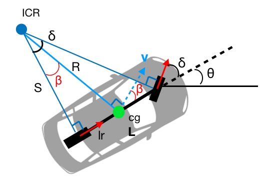

# SAE 자율 주행 자동차 기술 6단계
|레벨|설명|
|:---:|:---:|
|0|비자동화, 운전자가 전부 통제|
|1|운전자 지원 기능, 자동 속도 조절 등의 운전 보조|
|2|운전자가 운전하는 상황에서 조향 및 감가속 동시 작동|
|3|차량이 특정 조건 하에 운전 통제, 비상 상황시 운전자에 통제권 이양|
|4|차량이 운전 완전 통제, 운전자의 선택적 개입|
|5|운전자 불필요|

# 좌표계
## 좌표계
 - 공간상에서 물체의 위치를 표현하는 체계
 - 대표적인 좌표계: 직교좌표계, 원통좌표계, 구면좌표계
 - **직교좌표계**
   - 3개의 축인 x, y, z가 서로 직각을 이루고 3개의 축이 3차원을 표현하는 좌표계
   - 활용: IMU 센서
 - **원통좌표계**
   - 극좌표계: 물체의 위치를 반지름과 각도로 표현하는 좌표계, 반지름은 물체와의 거리, 각도는 기준각도와 이루는 각을 말한다.
   - 극좌표계에 3차원 공간을 표현하기 위해 평면 극좌표계에 평면에서부터 높이값을 더해 만들어진 좌표계를 말한다.
   - 활용: LiDAR 센서
 - **구면좌표계**
   - 3차원 공간의 위치를 나타내는 좌표계
   - 원점에서 물체와의 반지름, x축과 이루는 가도, z축과 이루는 각도로 물체의 위치를 표현한다.
   - 활용: GPS 센서
 - 어떤 기준으로 물체의 위치를 표현 하느냐에 따라서 같은 물체라도 다르게 표현될 수 있다.
 - 하나의 좌표계만을 사용하지 않는 경우도 있다.
   - 다절 링크의 경우 물체의 운동을 기술하거나 계산할 때 월드좌표계와 로컬좌표계를 모두 이용할 수 있다.

# GPS 좌표계
## WGS
 - 세계 지구 좌표 시스템(World Geodetic System)
 - 지구의 중심을 원점으로 하고 지구의 회전 축이 Z축과 평행한 좌표계
 - 위도는 적도, 경도는 영국 그리니치 천문대를 기준으로 구분한다.
 - GPS 데이터는 WGS84를 기준으로 한다.
 - WGS84 좌표계는 바로 2D 좌표계 기준 경로 계획 문제를 해결할 수 없기 떄문에, 평면 좌표계로 변환하여 사용해야한다. 이때, TM 좌표계를 사용한다.
## TM 좌표계
- 횡축 메르카토르도법을 이용하여 구성되며, 기준 평면과 Projection 방법에 따라 달라진다.
- 한반도는 UTM 52 좌표를 기준으로 사용해야 한다.

# 물체의 자세
- 물체의 자세는 기준 좌표계에서 물체가 얼마나 회전되어 있는지로 나타내며, 오일러각과 쿼터니언으로 표현할 수 있다.
- 오일러각
  - 3축의 회전(Roll, Pitch, Yaw)로 표현한다.
  - 이해하기 쉽지만 몇몇 자세를 표현하지 못한다 -> 짐벌락 현상
  - 어떤 축을 먼저 회전 시키냐에 따라 계산 결과가 달라진다.
- 쿼터니언 타원체
  - x, y, z, w 변수로 표현하며, 벡터 w의 스칼라 값으로 x, y, z를 사용한다.
  - 각 축을 한꺼번에 계산하지 않기 때문에 짐벌락 현상이 발생하지 않는다.
  - 어떤 회전각이든 계산 가능하며 빠른 연산 처리가 가능하다.
- IMU 센서에서 얻은 각속도 데이터를 통해 물체의 자세를 추정하며, 쿼터니언<->오일러각 변환 작업이 필요하다.

# 정밀도로 지도
- 자율주행 등에 필요한 정보를 3차원으로 제작한 전자지도
- 크게 차선, 도로시설, 표시시설의 3가지 범주로 구성된다.
- 구성
  - 차선: 규제선, 도로경계선, 정지선, 차로 중심선
  - 도로시설: 중앙분리대, 터널, 교량, 지하차도
  - 표지시설: 교통안전표시, 노면표시, 신호기
- 0.25m급 해상도를 가지며 국토지리정보원에서 제작 및 배포 중 이다.
- m 단위 급의 오차가 생기면 도로 폭으로 사고가 발생할 수 있다.
- 센서가 갖는 기술적 한계를 보완하여 신뢰성 있게 자율주행차를 구동시키는데 정밀한 위치 정보를 가지고 차량에 미리 입력되어 있는 지도 정보가 필수적이다.
- 센서에서 처리하는 데이터 양이 너무 많기 떄문에 미리 정밀지도를 통해 정보를 어느정도 파악하는 용도로 사용된다.

# MGeo
- MORAI 시뮬레이터에서 사용되는 정밀지도 포맷이다.
## 클래스
- 형상을 표현하는 클래스
 
|클래스|설명|
|:---:|:---:|
|BasePoint|한 개의 점으로 표현|
|BaseLine|여러 개의 점이 모인 Line|
|BasePlane|여러 개의 점이 모여 시작점과 끝을 연결함|

- 주행 경로를 표현하기 위한 데이터

|클래스|설명|
|:---:|:---:|
|Node|서로 다른 두 개 이상의 Link 간의 연결 여부|
|Line|연결성을 표현할 수 있는 (단방향)선 -> Line의 전후 Node를 조회|
|Link|차량의 주행 경로 -> 좌우 Link를 찾음|

## 노드와 링크
### 노드 정보

- 필드

|필드|설명|
|:---:|:---:|
|Idx|노드이름|
|to_links|노드에서 나가는 링크 리스트|
|from_links|노드로 들어오는 링크 리스트|
|on_stop_line|정지선 여부|

- 메소드

|메소드|설명|
|:---:|:---:|
|get_to_links()|노드에서 나가는 링크 리스트 리턴|
|get_from_links()|노드로 들어오는 링크 리스트 리턴|
|get_to_links_idx_list()|나가는 링크 아이디 리스트 리턴|
|get_from_links_idx_list()|들어오는 링크 아이디 리스트 리턴|
|get_from_nodes()|이전 연결된 노드 리스트 리턴|
|get_to_nodes()|다음될 노드 리스트 리턴|
|print_all_related_nodes_and_links()|연결된 노드, 링크를 모두 출력|

### 링크 정보

- 필드

|필드|설명|
|:---:|:---:|
|Idx|링크 이름|
|from_node|링크 시작 노드|
|to_node|링크 끝 노드|
|lazy_point_init|차선 변경 링크 여부|
|lane_change_pair_list|차선 변경 링크 리스트|
|max_speed_kph|링크에서 주행할 수 있는 최대속도|
|min_speed_kph|링크에서 주행할 수 있는 최저속도|
|traffic_signs|연결된 신호등|
|traffic_lights|받아야하는 신호등 신호|

- 메소드

|메소드|설명|
|:---:|:---:|
|get_to_node()|링크 끝 노드 리턴|
|get_from_node()|링크 시작 노드 리턴|
|get_to_links()|나가는 링크 리스트 리턴|
|get_from_links()|들어오는 링크 리스트 리턴|
|is_it_for_lane_change()|차선변경 링크인지 리턴|
|get_lane_change_pair_list()|차선변경할 수 있는 링크 리스트 리턴|
|get_number_of_lane_change()|차선변경할 수 있는 링크 갯수 리턴|

# 경로 계획
- 차량이 주행할 경로를 만들어주는 과정
- 경로 계획시에는 안전한 경로인지, 최적화된(Cost가 낮은) 경로인지를 고려해야한다.
- 전역(Global) 경로 계획, 지역(Local) 경로 계획으로 나눌 수 있다.

# Dijkstra
- 그래프에서 노드 간에 최단 경로를 찾는 알고리즘이며, 시작 노드부터 다른 모든 노드까지의 최단 경로를 찾는다.
- 다익스트라 알고리즘 동작 과정
  1. 시작 노드를 지정
  2. 시작 노드를 기준으로 다른 노드와의 비용을 저장
  3. 방문하지 않는 노드들 중에서 가장 적은 거리 비용이 드는 노드부터 방문
  4. 방문한 노드와 인접한 노드들을 조사해서 새로 조사된 최단 거리가 발견된 최단 거리보다 작으면 정보를 갱신
     - 새로운 최단 거리: (시작 노드 ~ 방문 노드까지의 거리 비용) + (방문 노드 ~ 인접 노드까지의 거리 비용)
     - 기존 최단 거리: (시작 노드 ~ 인접 노드까지의 거리 비용)
  5. 3~4번 반복

# Pure pursuit
- 경로 위의 한 점을 원 호를 그리며 따라가는 방법
- 자동차의 기구학과 전방주시거리(Look-Ahead_Distance) 하나로 조향각을 간단하게 계산할 수 있다.
- 실제 자동차 모델(Ackermann geometry)을 단순화한 Bicyle model을 사용하며, Bicyle model은 뒷 바퀴 1개, 앞 바퀴 1개를 사용한다.

  

# PID
- PID 제어는 원하는 값에 도달하기 위한 기초적인 자동 피드백 제어 방법 중 하나이다.
- 수식이 매우 간단하고, 제어 대상의 모델이 필요하지 않으며, 구현 난이도 대비 목표치 추종이나 외란 감쇄 효관에 탁월한 성능을 얻을 수 있다.
- 우리의 제어기에서는 목표속도, 현재속도, 오차(목표 속도 - 현재 속도)를 사용한다.
- 오차 값을 가지고 P(비례), I(적분), D(미분)을 통해서 현재 값을 목표 값으로 수렴시킬 수 있다.
- 원하는 성능을 얻기 위해서 PID 각각의 이득 값을 적절히 튜닝하는 과정이 필요하다. 적절한 이득 값을 찾지 못하면 시간이 지나도 오차값이 계속 남아있거나 목표 값에서 더 멀어져서 시스템이 매우 불안정해질 수 있다.

  

- 수식 분석
  - 비례항: 현재 상태에서의 오차 값의 크기에 비례한 제어작용을 한다.
  - 적분항: 정상 상태(Steady-state) 오차를 없애는 작용을 한다.
  - 미분항: 출력 값의 급격한 변화에 제동을 걸어 Overshoot을 줄이고 안정성을 향상시킨다.

  

- PID 성능 지표
  - Rise Time: 목표 값의 10%에서 90%까지 도달하는 데 걸리는 시간
  - OverShoot: 현재 값이 목표 값보다 커졌을 때의 값
  - Setting Time: 목표 값의 5% 이내에 들어갈 때의 시간
  - Steady-State Error: 정상 상태에 도달하고 나서 존재하는 에러

  

# 경로 기반 속도 계획
- 경로에서 얼마만큼의 속도를 내야하는 지를 계획하는 것이다.
- 곡선을 주행할 때 구심력의 작용·반작용으로 인해 원심력을 받게 된다. 이로 인해 속도가 빠르거나 회전반경이 작을수록 차량이 전복되기 쉬워진다.
- F = mv^2 / r, V(max) = √(rgμ)
- 경로의 곡률반지름(r)을 안다면 곡선도로에서의 최대속도를 알 수 있으며 μ는 운동마찰계수이다.
- 국률반지름은 최소자승법을 통해 구현할 수 있다.

# ACC(Adaptive Cruise Control)

- 운전자가 설정한 속도로 주행을 하다가 센서로 선행 차량을 인지하고 간격을 유지하는 시스템을 말한다.

  

