# 프로젝트 실행 및 결과
## 1. Sensor 메시지 GPS - parser
### 코드

    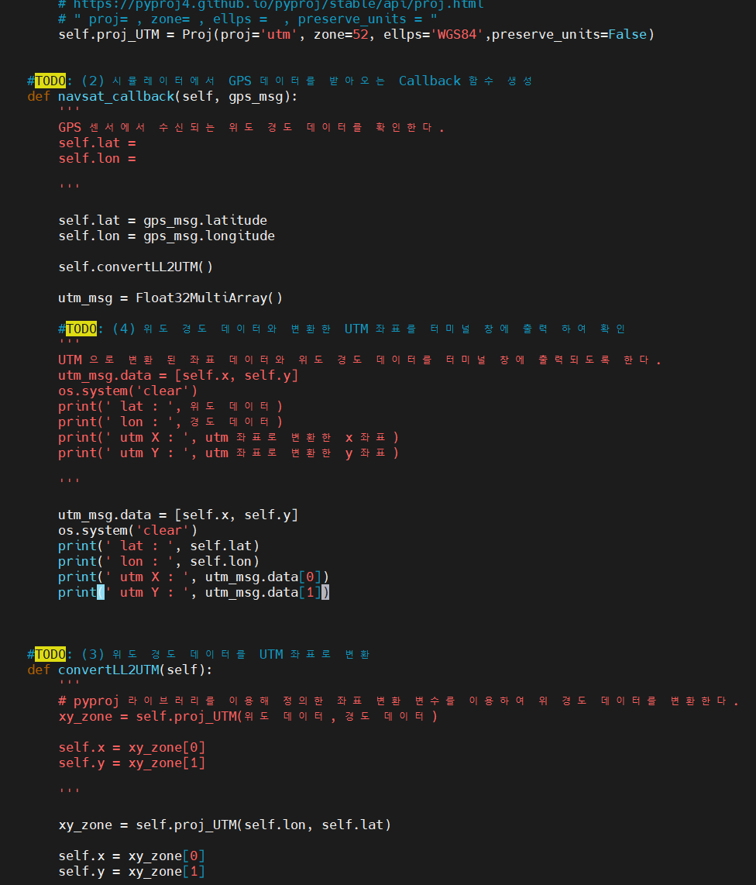

### 결과

    

## 2. Sensor 메시지 GPSIMU - parser
### 코드

    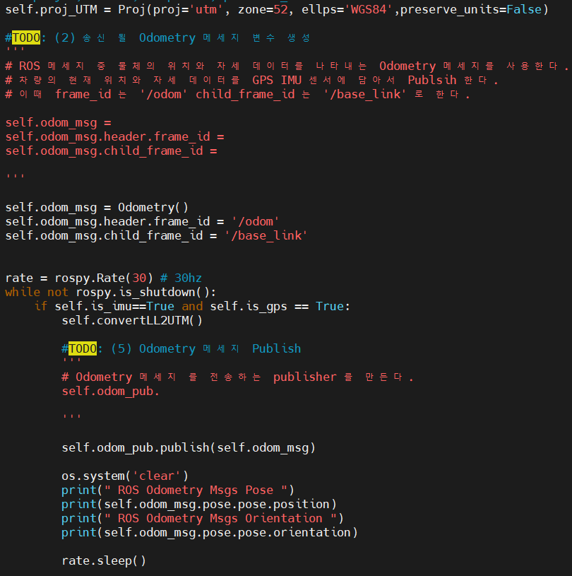

    

### 결과

    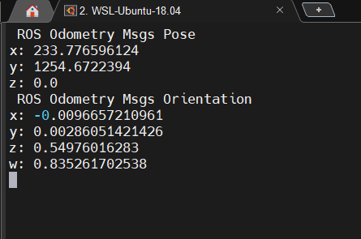

## 3. Ego 상태 TF 브로드캐스팅
### 코드

    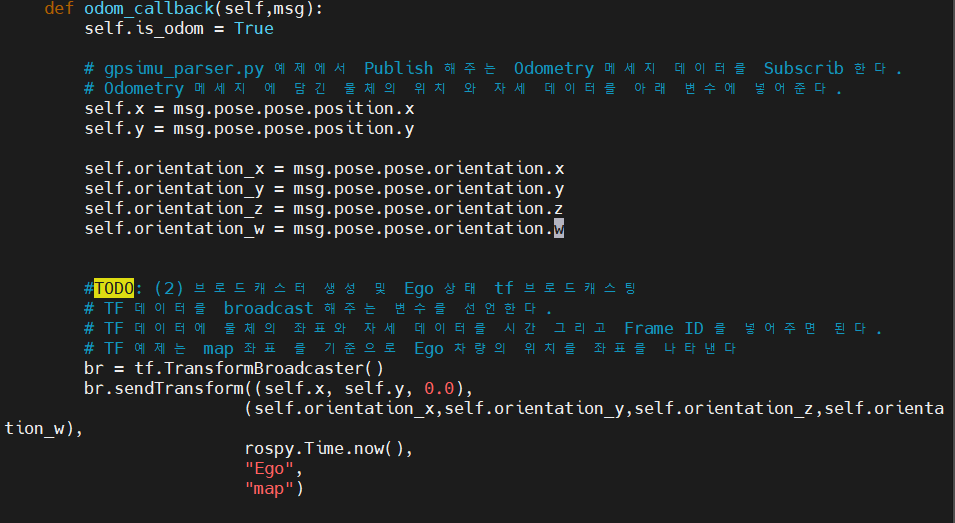

### 결과

    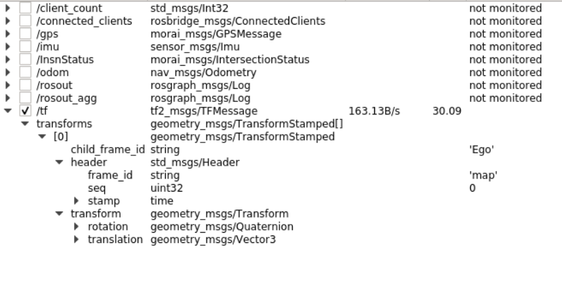

## 4. MGeo 사용

### 결과

    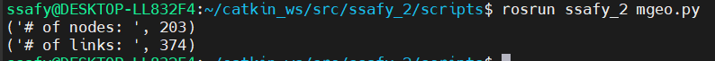

## 5. MGeo Publish

### 코드

    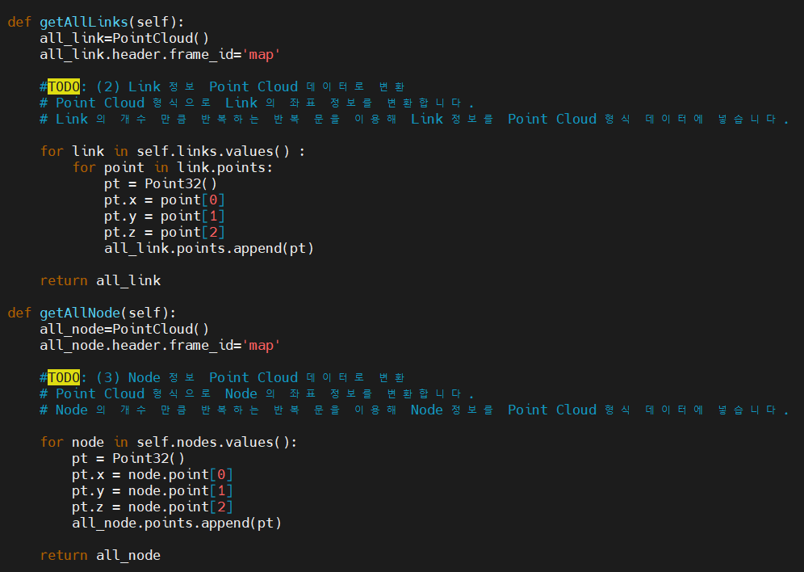

### 결과

    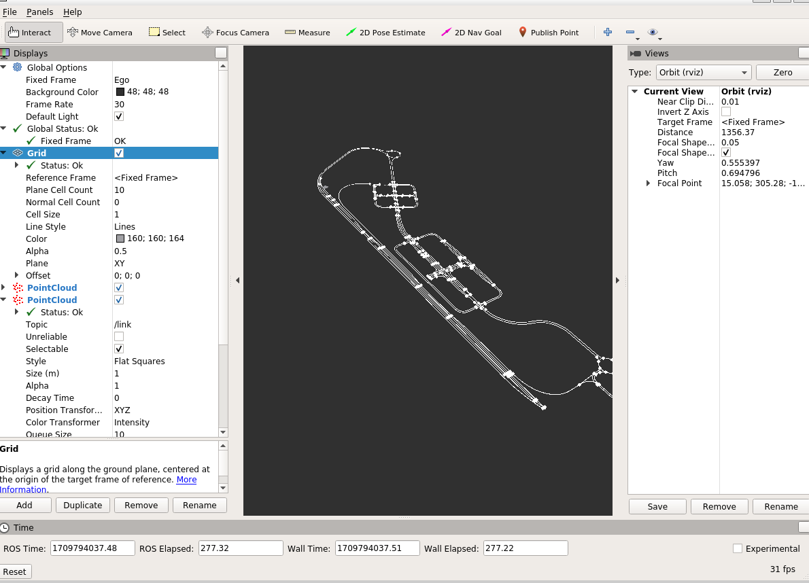

## 6. Path make

### 코드

    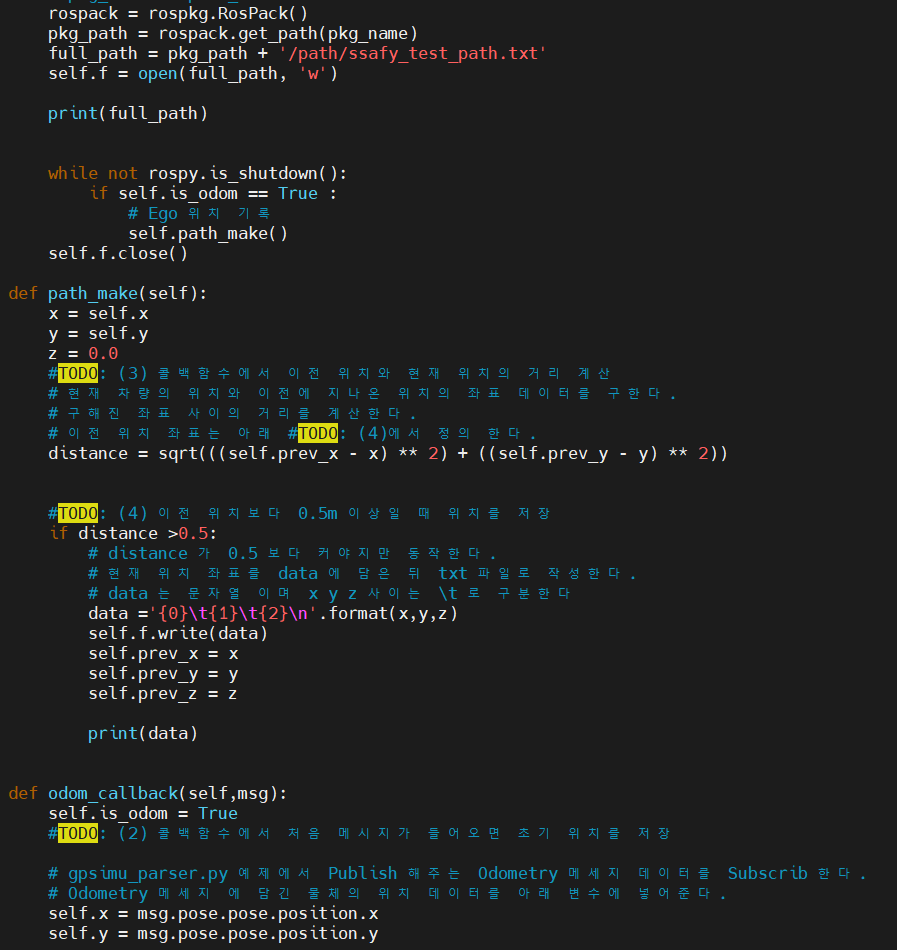

### 결과

    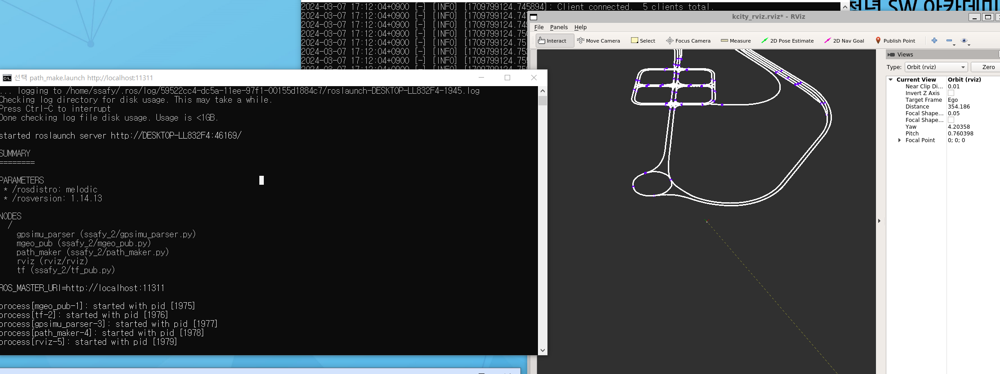

    

## 7. Path_Publish

### 코드

    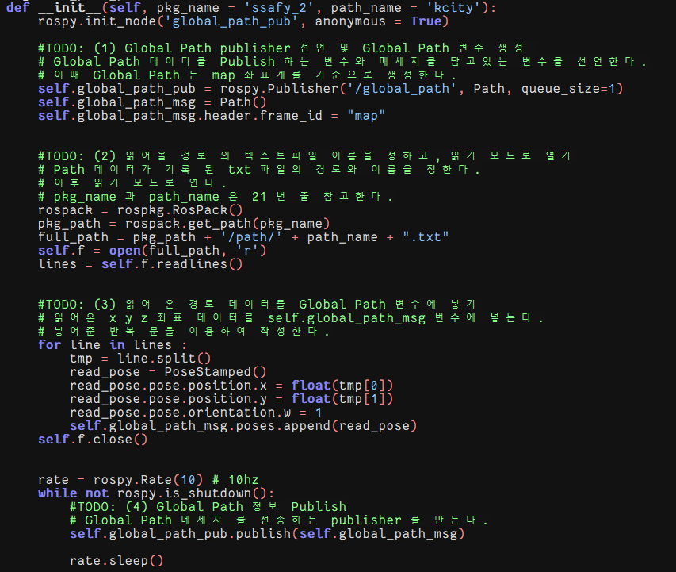

### 결과

    

## 8. Dijkstra Path

### 8-1. mgeo_dijkstra_path_1.py
#### 코드

    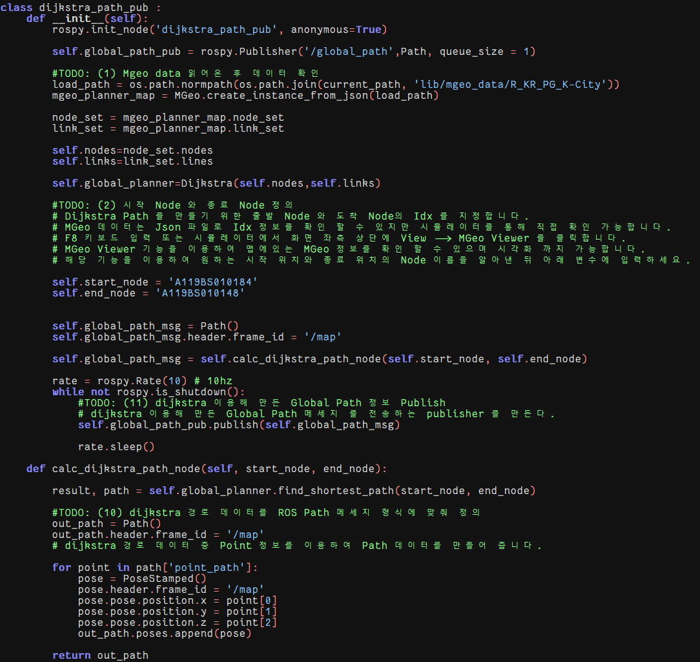

    

    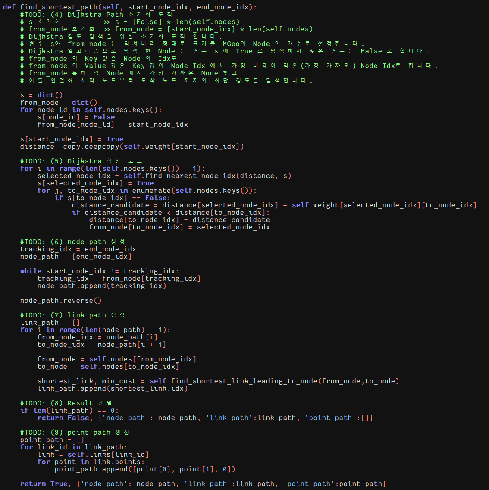

#### 결과

    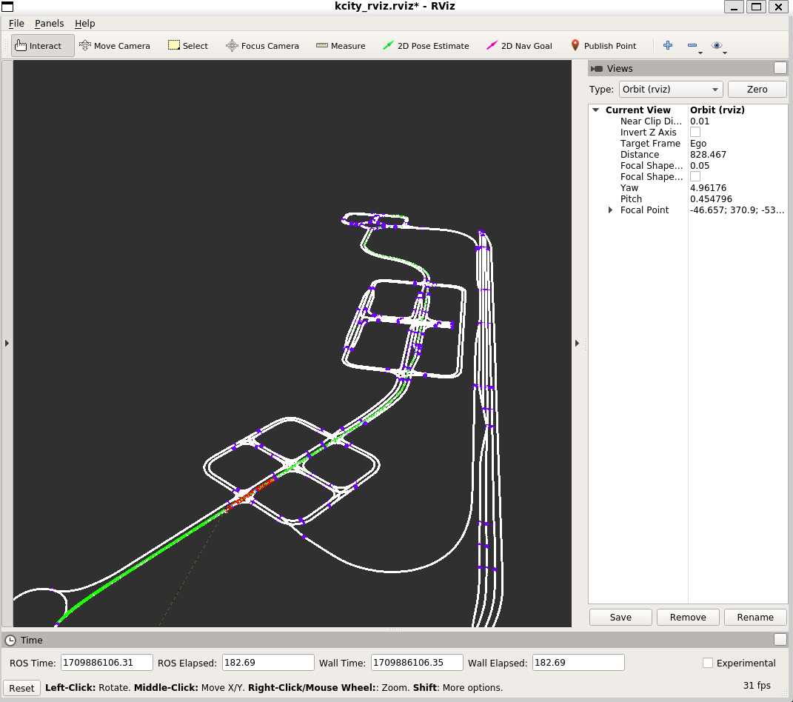

