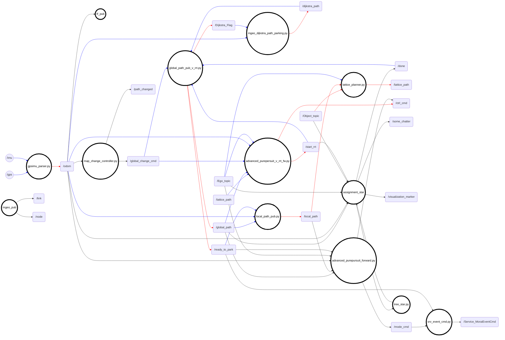
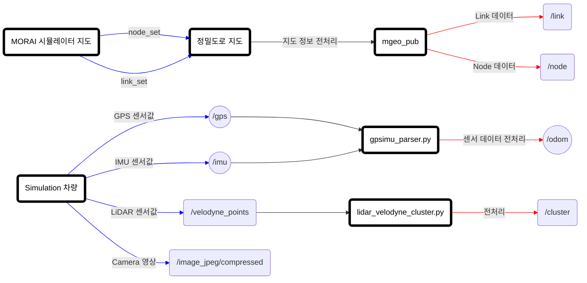
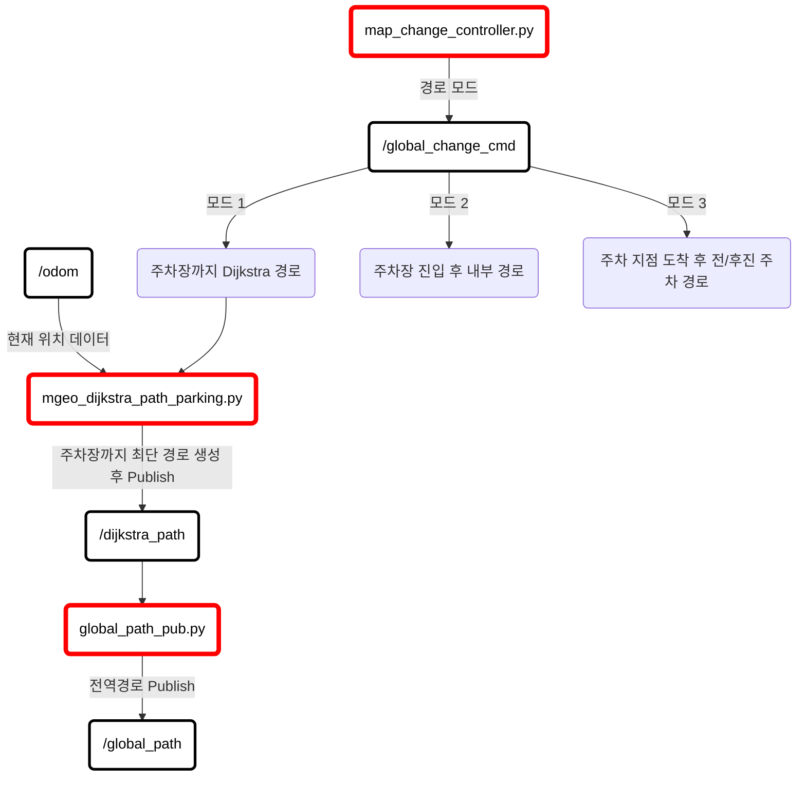
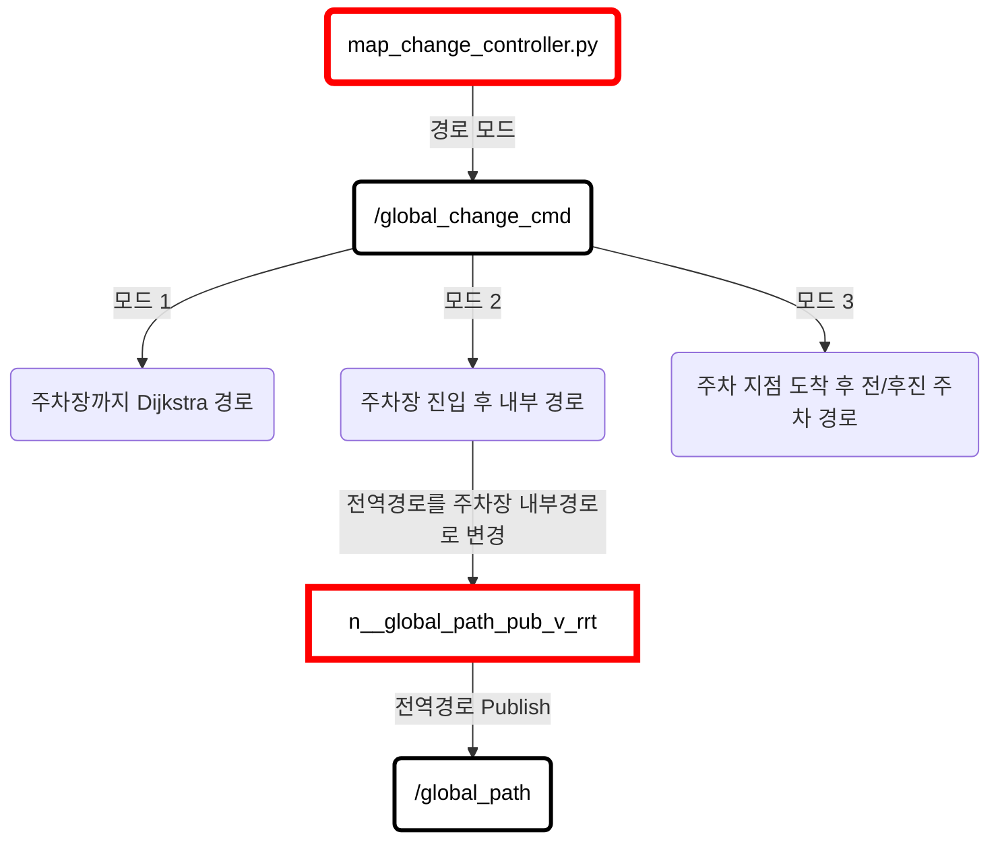
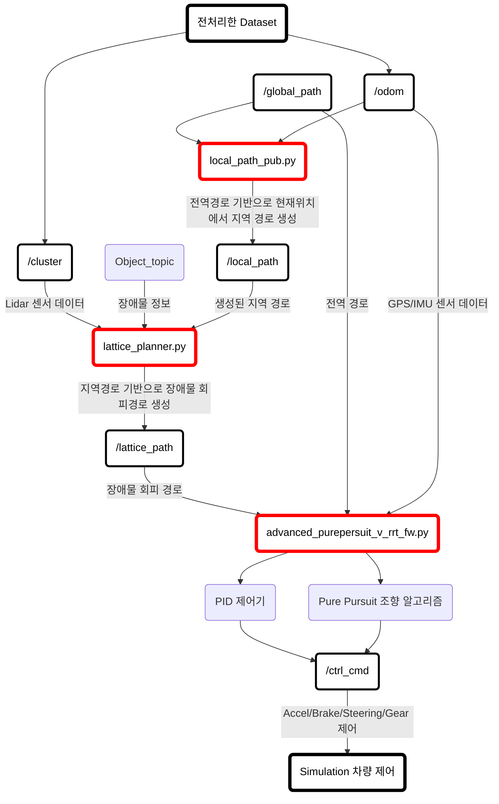
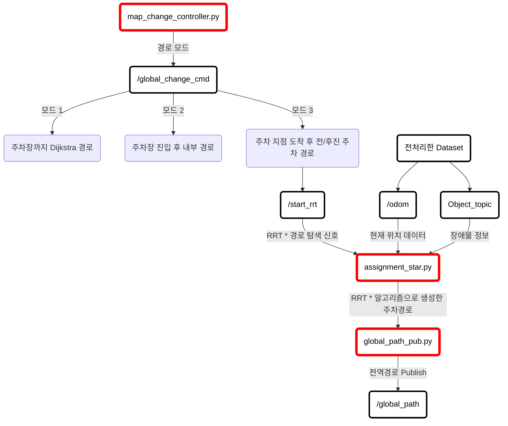
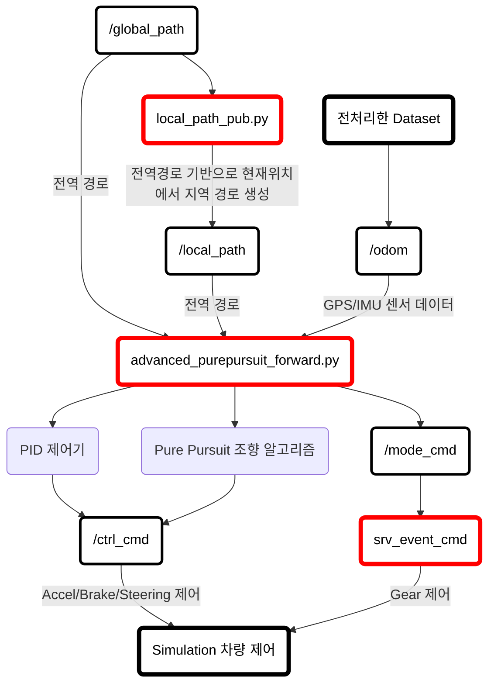
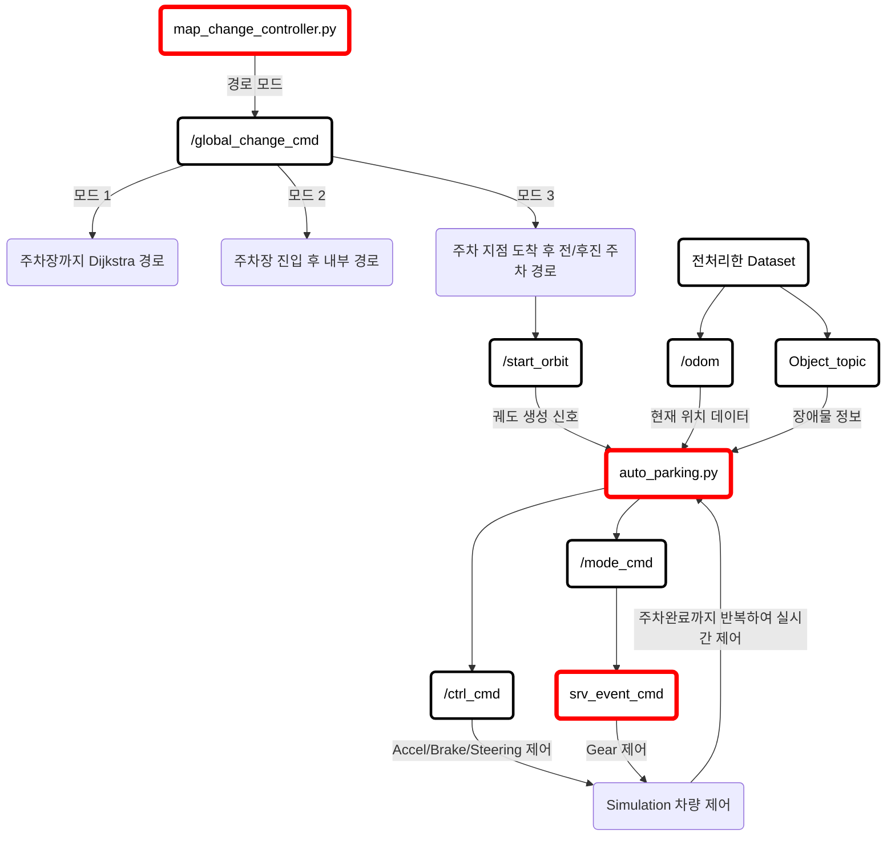

# 주행/주차 시스템 아키텍쳐 
### (Driving/Parking System Architecture)

 

#### 목차

1. [RQT 노드 그래프](#1-rqt-노드-그래프)
2. [전체 시스템 아키텍쳐](#2-전체-아키텍쳐)
3. [Simulator 데이터 연동 (정밀도로지도 및 센서 데이터)](#3-simulator-데이터-연동-아키텍쳐-정밀도로-지도-및-센서-데이터)
4. [주행 아키텍쳐 (하차지점 -> 주차지점)](#4-주행-아키텍쳐)
    - [Dijkstra 경로 생성](#4-1-dijkstra-경로-생성-현재위치-→-주차장-입구)
    - [주차장 내부 경로 생성](#4-2-주차장-내부-경로-생성-주차장-입구-→-주차-지점)
    - [주행 제어기](#4-3-주행-제어기-제어-로직)

5. [주차 아키텍쳐](#5-주차-아키텍쳐)
    - [RRT * 알고리즘을 활용한 주차 경로 생성](#5-1-rrt--알고리즘을-통한-주차-경로-생성)
    - [RRT * 경로 전진/후진 주차 제어 로직](#5-2-rrt--경로-전진후진-주차-제어-로직)
    - [궤도 생성 알고리즘을 통한 주차 로직](#5-3-궤도-생성-알고리즘을-통한-주차-제어-로직)

---

 

## 1. RQT 노드 그래프

```mermaid
graph TD;
    t___local_path((/local_path)) -->|publishes| n___lattice_planner
    t___local_path -->|publishes| n___advanced_purepursuit_forward
    t___local_path -->|publishes| n___ctrl_cmd
    t___lattice_path((/lattice_path)) -->|publishes| n___advanced_purepursuit_v_rrt_fw
    t___global_path((/global_path)) -->|publishes| n___assignment_star
    t___global_path -->|publishes| n___local_path_pub
    t___global_path -->|publishes| n___advanced_purepursuit_forward
    t___global_path -->|publishes| n___advanced_purepursuit_v_rrt_fw
    t___odom((/odom)) -->|broadcasts| n___tf
    t___odom -->|publishes| n___assignment_star
    t___odom -->|publishes| n___local_path_pub
    t___odom -->|publishes| n___map_change_controller
    t___odom -->|publishes| n___advanced_purepursuit_forward
    t___odom -->|publishes| n___advanced_purepursuit_v_rrt_fw
    t___global_change_cmd((/global_change_cmd)) -->|publishes| n___global_path_pub_v_rrt
    t___global_change_cmd -->|publishes| n___advanced_purepursuit_v_rrt_fw
    t___done((/done)) -->|publishes| n___global_path_pub_v_rrt
    t___Object_topic((/Object_topic)) -->|publishes| n___assignment_star
    t___Object_topic -->|publishes| n___lattice_planner
    t___imu((/imu)) -->|publishes| n___gpsimu_parser
    t___mode_cmd((/mode_cmd)) -->|publishes| n___srv_event_cmd
    t___start_rrt((/start_rrt)) -->|publishes| n___assignment_star
    t___start_rrt -->|publishes| n___global_path_pub_v_rrt
    t___ready_to_park((/ready_to_park)) -->|publishes| n___local_path_pub
    t___ready_to_park -->|publishes| n___srv_event_cmd
    t___ready_to_park -->|publishes| n___advanced_purepursuit_forward
    t___visualization_marker((/visualization_marker)) -->|publishes| n___assignment_star
    t___visualization_marker -->|publishes| n___global_path_pub_v_rrt
    t___Ego_topic((/Ego_topic)) -->|publishes| n___assignment_star
    t___Ego_topic -->|publishes| n___lattice_planner
    t___Ego_topic -->|publishes| n___advanced_purepursuit_forward
    t___Ego_topic -->|publishes| n___advanced_purepursuit_v_rrt_fw
    t___gps((/gps)) -->|publishes| n___gpsimu_parser
    t___rosbridge_websocket((/rosbridge_websocket)) -->|publishes| n___Object_topic
    t___rosbridge_websocket -->|publishes| n___imu
    t___rosbridge_websocket -->|publishes| n___Ego_topic
    t___rosbridge_websocket -->|publishes| n___gps
    t___gpsimu_parser -->|publishes| n___odom
    t___advanced_purepursuit_forward -->|publishes| n___ctrl_cmd
    t___advanced_purepursuit_forward -->|publishes| n___mode_cmd
    t___rosapi((/rosapi)) -->|publishes| n___assignment_star
    t___rosapi -->|publishes| n___lattice_planner
    t___mgeo_pub((/mgeo_pub)) -->|publishes| n___link
    t___mgeo_pub -->|publishes| n___node
    t___lattice_planner -->|subscribes| t___lattice_path
    t___advanced_purepursuit_v_rrt_fw -->|publishes| t___ctrl_cmd
    t___advanced_purepursuit_v_rrt_fw -->|publishes| t___start_rrt

```

---

 

## 2. 전체 아키텍쳐

---

 

## 3. Simulator 데이터 연동 아키텍쳐 (정밀도로 지도 및 센서 데이터)

---

 

## 4. 주행 아키텍쳐

 

#### 4-1) Dijkstra 경로 생성 (현재위치 → 주차장 입구)

 

 

#### 4-2) 주차장 내부 경로 생성 (주차장 입구 → 주차 지점)

 

 

#### 4-3) 주행 제어기 (제어 로직)

---

 

## 5. 주차 아키텍쳐

##### 💡 주차 자리를 찾은 후 주차 모드로 변경됨

 

#### 5-1) RRT * 알고리즘을 통한 주차 경로 생성

 

#### 5-2) RRT * 경로 전진/후진 주차 제어 로직

 

##### 💡 전진/후진 시 제어기 별도로 관리함 (아래 로직은 전진의 경우)

 

 

#### 5-3) 궤도 생성 알고리즘을 통한 주차 제어 로직

 

