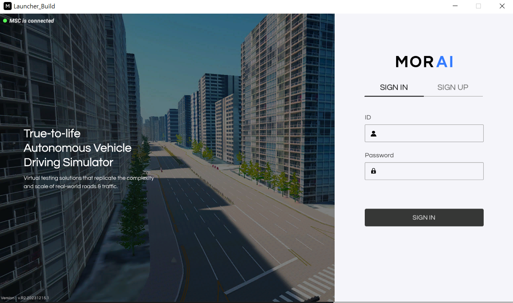
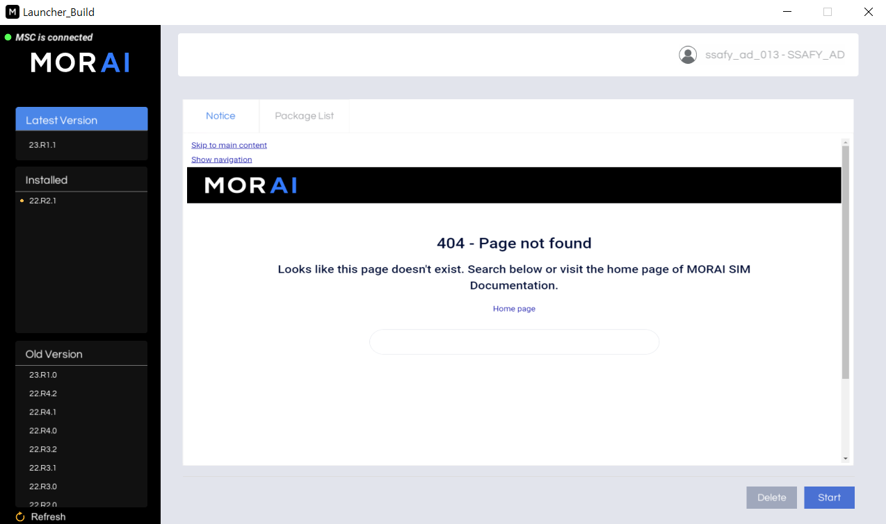
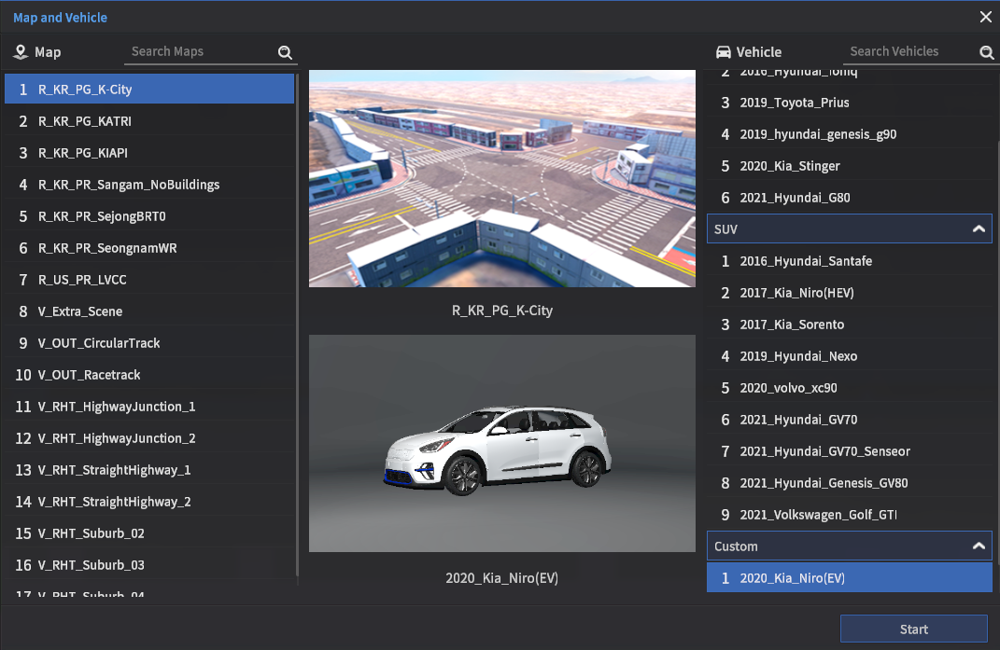
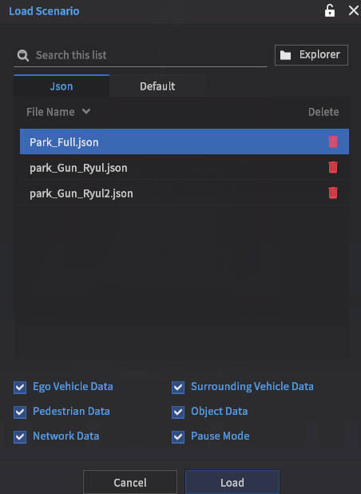

# 프로젝트 실행 방법
## 시뮬레이터 실행







 - 시뮬레이터를 실행해서 K-City 맵과 2020 기아 니로 차량을 선택한다.

    

 - 깃랩 저장소에서 받은 시나리오를 로드한다.

## WSL내에서 프로젝트 실행
- 터미널 내에서 rosbridge server를 실행한다.
```bash
roslaunch rosbridge_server rosbridge_websocket.launch
```
### 단일 파일 실행
- 다른 터미널을 열고 필요한 런치 파일을 실행한다.
```bash
roslaunch (패키지명) (런치파일명)
```
- 다른 터미널을 열고 메인 실행 코드를 실행한다.
```bash
rosrun (패키지명) (실행파일명).py
```

### 전체 테스트 실행
- 터미널을 열고 전체 테스트 런치 파일을 실행한다.
```bash
roslaunch integration_test testinit
```
- 전체 테스트는 실행 코드와의 동기화를 위해 숫자 1 입력을 필요로 한다.