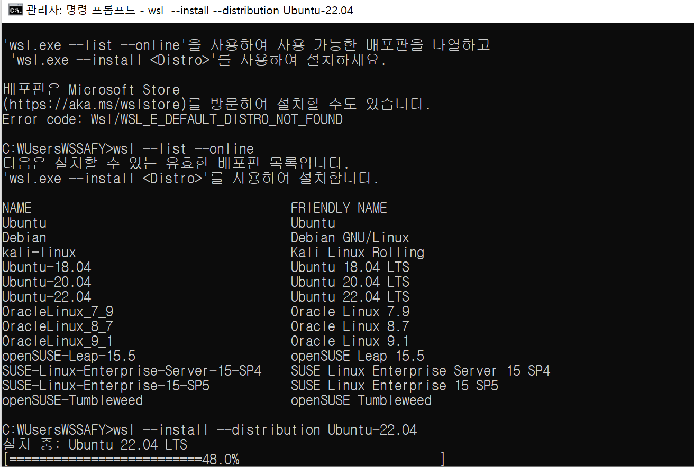
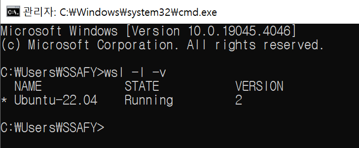
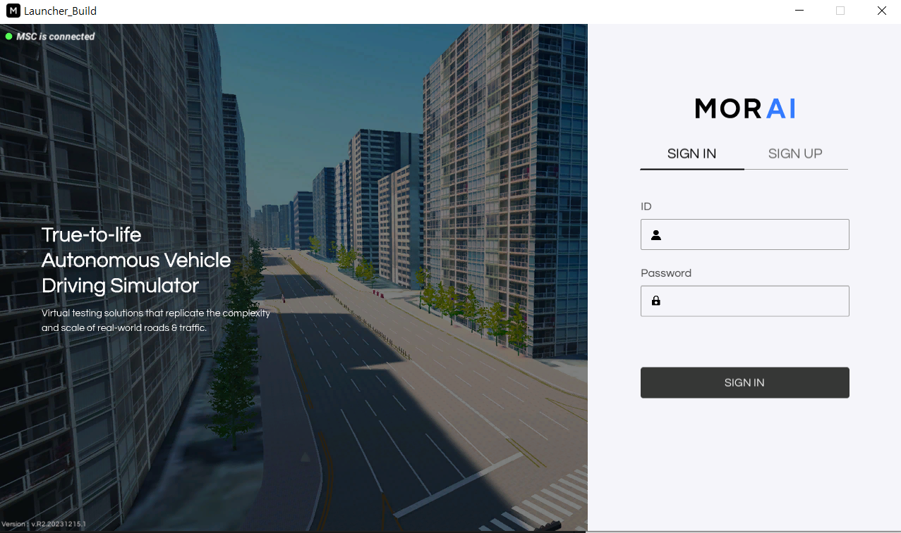
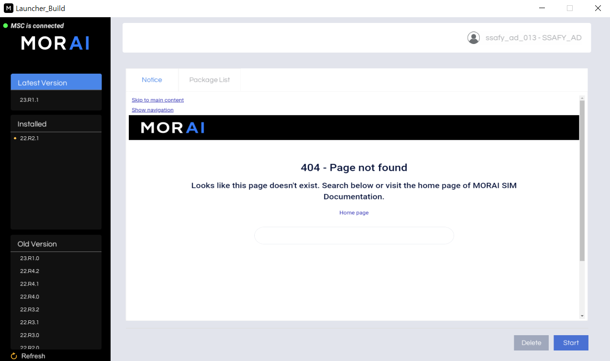
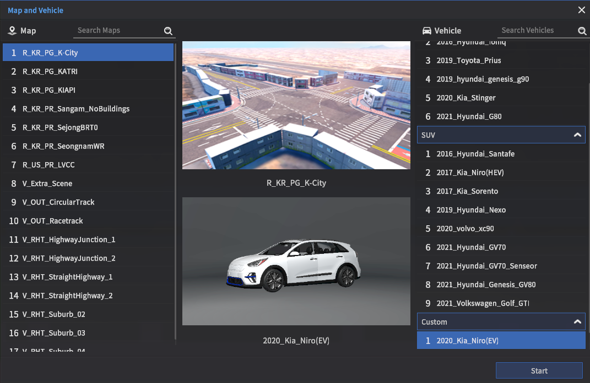
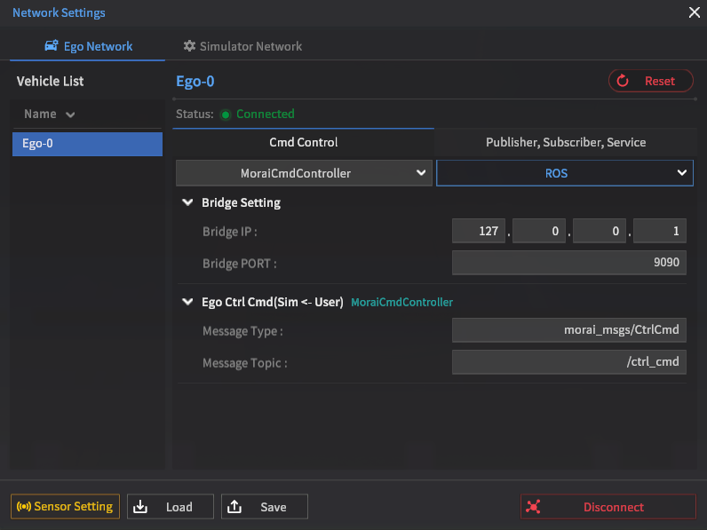
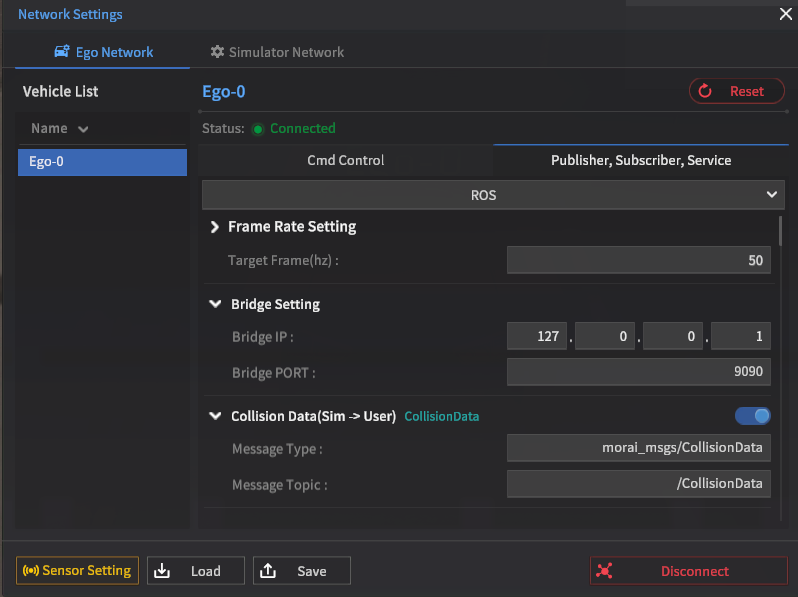
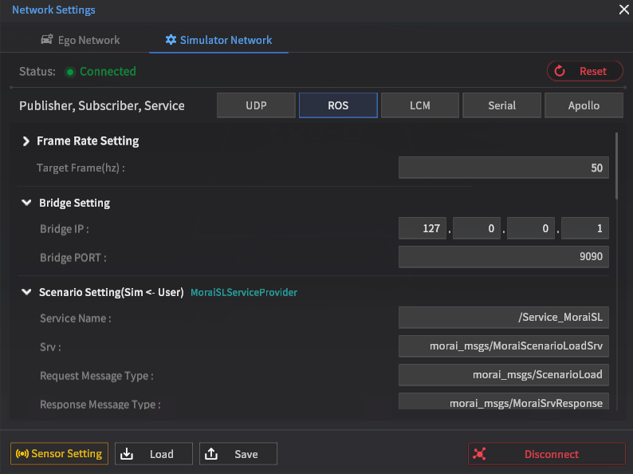
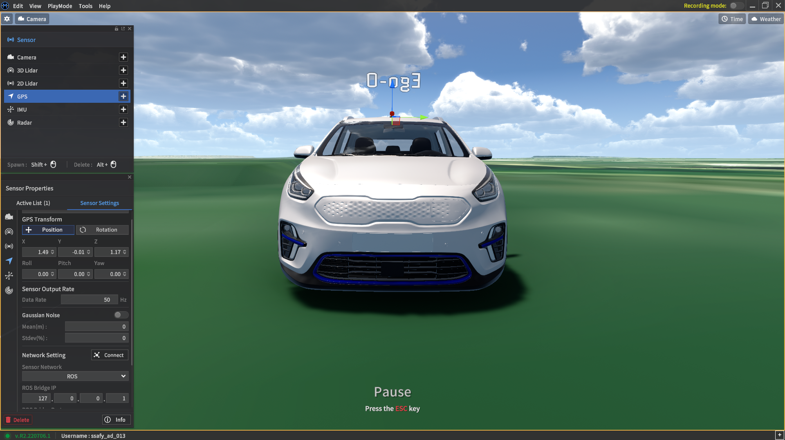
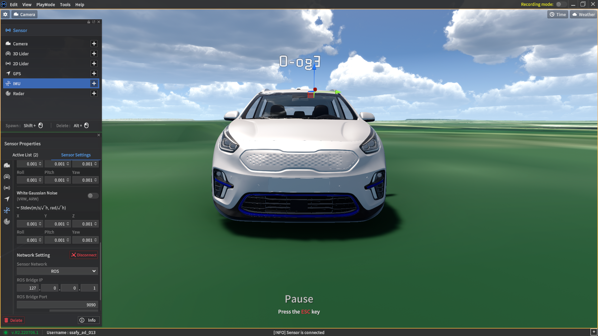

# 프로젝트 환경 설정
- 해당 프로젝트는 리눅스 환경(Ubuntu 18.04)에서 개발되었으며, 성능 확보를 위해 시뮬레이터와 프로젝트가 동일한 환경에서 실행되도록 해야 한다.
- 해당 문서에서는 윈도우 내에서 시뮬레이터 실행 및 WSL 환경 설치 후 프로젝트 실행을 권장하며, 이를 위한 WSL 및 ROS 1 프로그램 설치 방법을 정리하였다.


## 개발환경
### PC 사양
|분류|사양|
|:---:|:---|
|CPU|11th Gen Intel(R) Core(TM) i7-11600H @ 2.90GHz   2.92 GHz|
|RAM|32.0GB|
|GPU|NVIDIA GeForce RTX 3050 Ti Laptop GPU|
|OS|Windows 10 Enterprise|

### WSL 환경
|분류|Ubuntu 18.04|Ubuntu 20.04|
|:---:|:---|:---|
|Python|2.7.17|3.8.10|
|ROS|melodic|noetic|

## WSL + Ubuntu 설치

### WSL 설치

---

```bash
wsl --install
```

### Ubuntu 설치

---

```bash
wsl --install --distribution Ubuntu-18.04
```



- 설치 완료 후 username + password 입력

- ubuntu 설치 확인 (CMD)
    
    ```bash
    wsl -l -v
    ```
    
    

## ROS 통신 환경 구성

- 시뮬레이터에서 ROS 통신을 하기 위한 사전 구성

### ROS 및 종속 프로그램 설치

---

- OS : Ubuntu-18.04 (WSL2)
    
    ```bash
    # ros-latest.list에 ROS 저장소를 추가
    $ sudo sh -c 'echo "deb http://packages.ros.org/ros/ubuntu $(lsb_release -sc ) main" > /etc/apt/sources.list.d/ros-latest.list’
    $ sudo apt-get install curl
    # ROS 저장소로부터 패키지를 내려받기 위해 공개키를 추가
    $ curl -s https://raw.githubusercontent.com/ros/rosdistro/master/ros.asc | sudo apt-key add –
    $ sudo apt-get update
    $ sudo apt-get upgrade
    # 데스크탑용 ROS 패키지 및 rqt 패키지 설치
    $ sudo apt install ros-melodic-desktop-full
    $ sudo apt-get install ros-melodic-rqt*
    $ sudo apt-get install ros-melodic-velodyne
    #기타 도구 및 필요 패키지 설치
    $ sudo apt-get install git
    $ sudo apt-get install net-tools
    $ sudo apt-get install python-pip
    $ pip install scikit-learn
    ```
    
- 터미널을 실행할 때 마다 Bash 설정을 위해 아래 코드 실행
    
    ```bash
    $ echo "source /opt/ros/melodic/setup.bash" >> ~/.bashrc
    $ source ~/.bashrc
    ```
    

- 의존성 패키지 설치
    
    ```bash
    $ sudo apt install python-rosdep python-rosinstall python-rosinstall-generator python-wstool build-essential
    # rosdep 초기화
    $ sudo apt install python-rosdep
    $ sudo rosdep init
    $ rosdep update
    ```
    

### ROS 작업 공간 구성

---

- catkin_ws 폴더 생성
    
    ```bash
    $ mkdir -p ~/catkin_ws/src
    $ cd ~/catkin_ws/src
    $ catkin_init_workspace
    $ cd ~/catkin_ws/
    $ catkin_make
    ```
    
- 자율 주행 예제 코드 + 메시지 파일 다운
    
    ```bash
    $ cd ~/catkin_ws/src
    # MORAI ROS 통신 예제 코드 및 메시지 파일 다운로드
    $ git clone https://github.com/MORAI-Autonomous/MORAI-DriveExample_ROS.git
    $ git clone https://github.com/MORAI-Autonomous/MORAI-ROS_morai_msgs
    # 센서 데이터 파싱 및 Visualization 예제 파일 다운로드
    $ git clone https://github.com/MORAI-Autonomous/MORAI-SensorExample.git 
    # Package 및 message build
    $ cd ..
    $ catkin_make
    # catkin 환경 변수 선언
    $ source ~/catkin_ws/devel/setup.bash
    # catkin 패키지 재구축
    $ rospack profile
    ```
    
- rosbridge 및 기타 패키지 설치
    
    ```bash
    $ sudo apt-get install ros-melodic-rosbridge-server
    $ sudo apt install terminator
    $ pip install pyproj
    $ sudo apt install libvulkan1
    $ cd ~/catkin_ws
    $ catkin_make
    ```
    

- Bash 환경 재 설정
    
    ```bash
    $ echo "source ~/catkin_ws/devel/setup.bash" >> ~/.bashrc
    $ source ~/.bashrc
    ```
    
- 재부팅(권장)
    
    ```bash
    $ sudo reboot
    ```
    
- 시뮬레이터 연동 확인
    
    ```bash
    $ roslaunch rosbridge_server rosbridge_websocket.launch
    ```
    
    - 터미널로 rosBridge 실행
    - 시뮬레이터에서 맵에 접속한 다음 ‘F4’를 눌러 네트워크 세팅
    - IP를 입력하고 Connect 클릭 (위 세팅은 local에서 동작하므로 127.0.0.1 입력)

- 프로젝트 클론

    ```bash
    $ cd ~
    $ git clone https://lab.ssafy.com/s10-mobility-autodriving-sub2/S10P22A410.git
    ```

    - 프로젝트에서 사용되는 git 저장소이며, 실행에 해당 프로젝트와 시뮬레이션의 통신을 통해 실행한다.

- 프로젝트 설치
  
  ```bash
    cd ~/S10P22A410
    catkin_make
    cd ./rrt/develop
    source setup.bash
  ```

- 시나리오 배치

    - 프로젝트 폴더 내의 시나리오 파일을 시뮬레이터 폴더 내에 옮긴다.
    - 윈도우 기준 위치: (시뮬레이터 디렉토리)\MoraiLauncher_Win_Data\SaveFile\Scenario\R_KR_PG_K-City\

## 시뮬레이터 세팅
### 시뮬레이터 실행



- 시뮬레이터 런처를 실행하고 지급 받은 권한 있는 계정으로 로그인한다.



- 런처내에서 시뮬레이터를 설치 및 실행한다. 해당 문서에서는 명세서에서 권장하고 ROS1과의 호환성을 위해 22.R.1 버전을 사용했다.

### 맵 차량 선택



- 프로젝트 실행에 사용할 맵과 차량을 선택한다.
- 해당 문서에서는 주차장 상황이 필요하기 때문에 **R_KR_PG_K-City** 맵과 해당 맵의 주차칸의 크기에 적당한 **2020_Kia_Niro(EV)** 차량 사용을 권장한다.

### 네트워크 세팅

- wsl 환경에서 rosbridge를 실행한 후 시뮬레이터와의 연결을 한다.

#### Ego 네트워크 세팅




- F4를 눌러 네트워크 세팅 화면에 진입하고 Ego 네트워크 세팅을 진행한다.
- *Cmd Control* 탭에 ROS 통신을 선택하고 통신을 위한 IP와 포트를 입력하고 connect를 누른다.
- *Publisher, Subscriber, Service* 탭을 누르고 같은 동작을 수행한다.
- 해당 프로젝트를 같은 로컬 환경에서 실행하므로 127.0.0.1을 유지한다.

#### 시뮬레이터 네트워크 세팅



- 네트워크 세팅 화면에서 Simulator 네트워크 탭을 눌러 설정한다.
- ROS 통신을 선택하고 통신을 위한 IP와 포트를 입력하고 connect를 누른다.

#### 센터 네트워크 세팅
- F3를 눌러 센서 세팅 화면에 진입하여 배치 및 네트워크 연결을 수행한다.
- GPS
    
- IMU
    
- 두 센서를 모두 차량의 중앙부에 부착하고 ROS 통신을 선택하여 connect를 누른다.